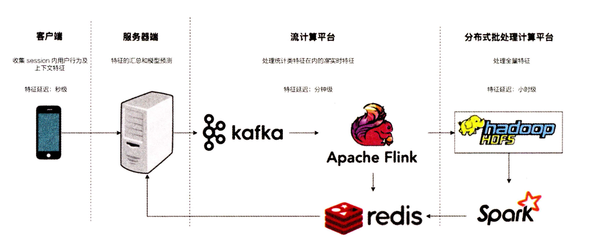
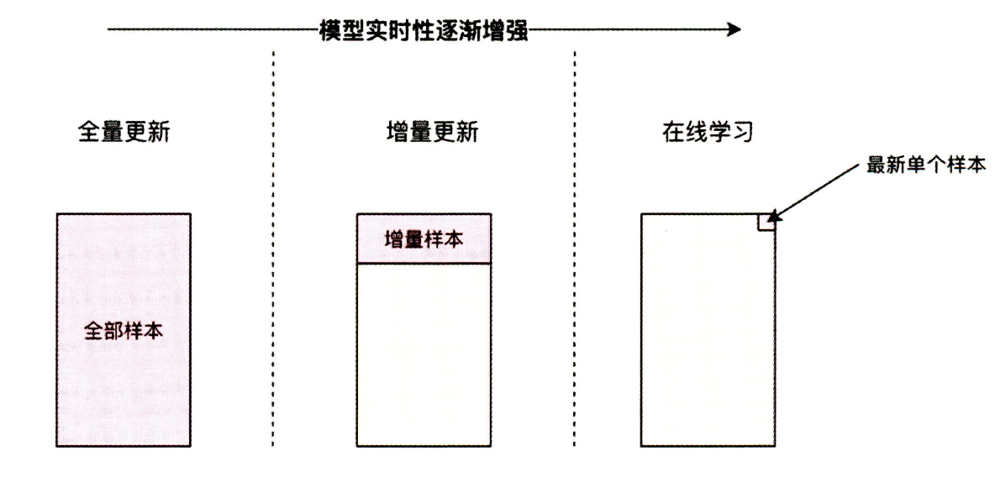

# 第五章 多角度审视推荐系统

## 5.1 推荐系统的特征工程
数据以及数据特征决定了机器学习模型效果上的上限，特征工程需要解决的三个问题：
- 构建特征工程应该遵循的基本原则是什么?
- 有哪些常用的特征类别?
- 如何在原始特征的基础上进行特征处理，生成可供推荐系统训练和推断 用的特征向量?

## 5.1.1 构建推荐系统特征工程的原则
特征的本质其实就是对某个行为过程相关信息的抽象表达，行为必须转换成某种数学形式才能够被机器学习模型学习，用多个维度上的特征来表达这一行为。构建特征的原则：保留推荐环境以及用户行为过程中比较有用的信息，去掉冗余的信息。通常需要自己设身处地的去思考。比如假设自己点击某部电影，那么点击的背后原因可能是哪些。

## 5.1.2 推荐系统中的常用特征
- 用户行为数据
  - 显性反馈行为：
    - 评分，点赞
  - 隐形反馈行为：
    - 点击，播放，加入购物车，购买，评论。
  - 隐性行为很重要，因为显性行为收集难度大，数据量小。
- 用户关系数据
  - 强关系：
    - 关注，好友关系
  - 弱关系：
    - 点赞，同一个社区，看同一部电影。
  - 可以把用户关系作为召回层的一种物品召回方式
  - 通过用户关系建立关系图，使用graph Embedding方法生成Embedding
  - 通过好友的特征为用户添加新的属性特征
- 属性、标签类数据
  - 用户
    - 年龄，性别，地址，用户兴趣标签
  - 物品
    - 商品的类别，价格
    - 一般multi-hot编码变为特征向量，比如商品类别特征，总共有20种，当前商品有3种类别特征，则变成[1, 1, 1, 0 ...]20维的特征，有类别的为1，没有的为0
    - 重要的转换成Embedding
- 内容类数据
  - 看作属性标签型特征的延伸，如描述型文字，图片，甚至视频。
  - 需要先通过nlp，cv技术提取特征。
- 上下文信息
  - 反应当时发生场景的信息
  - 如时间，地点，季节，月份，天气，空气质量，社会大事件等
- 统计类特征
  - 用统计方法计算出来的特征
  - 如历史CTR，历史CVR，物品热门程度，物品流行程度
  - 标准化归一化就可以直接输入推荐系统训练
  - 特征本质上是一些粗粒度的预测指标，比如历史CTR可以直接用于CTR预测，这一类特征往往与最后的预测目标有较强的相关性。
- 组合类特征
  - 比如年龄+性别，对于LR这一类的简单模型这些需要人工去做，对于深度学习模型也可以去交给模型自己学习

## 5.1.3 常用的特征处理方法
- 连续型特征
  - 最常用的处理手段：归一化、离散化、加非线性函数等方法。
  - 归一化统一各特征的量纲。统一到[0, 1]的区间或者变成均值0，方程1的正态分布。保证模型的稳定性，收敛的速度。
  - 离散化是通过确定分位数的形式将原来的连续值进行分桶，最终形成离散值的过程。这主要防止数值类型的特征过拟合以及数值类型的特征值分布不均匀，导致模型受到异常值的影响。
  - 加非线性函数，然后把原来的特征以及变换后的特征一起加到模型进行训练的过程。常用的非线性函数x^a, log(ax), log(x/(1-x))。目的是更好地捕获特征与优化目标之间的非线性关系，增强这个模型的非线性表达能力。
- 类别型特征
  - one-hot/multi-hot，问题在于特征向量维度过大，特征过于稀疏，容易造成模型欠拟合，而且参数权重太多。
  - Embedding

## 5.1.4 特征工程与业务理解
传统的人工特征组合、过滤的工作已经不存在了，取而代之的是将特征工程与模型结构统一思考、整体建模的深度学习模式。不变的是，只有深入了解业务的运行模式，了解用户在业务场景下的思考方式和行为动机，才能精确地抽取出最有价值的特征，构建成功的深度学习模型。

## 5.2 推荐系统召回层的主要策略
召回阶段负责将海量的候选集快速缩小为几百到几千的规模;而排序阶段则负责对缩小后的候选集进行精准排序。

## 5.2.1 召回层和排序层的功能特点
- 召回层：待计算的候选集合大，速度快，模型简单，特征较少，尽量让用户感兴趣的物品在这个阶段能够被快速召回，即保证相关物品的召回率。
- 排序层：首要目标是得到精准的排序结果。需处理的物品数量少，可利用较多特征，使用比较复杂的模型。
- 在权衡计算速度和召回率后，目前工业界主流的召回方法是采用多个简单策略叠加的 "多路召回策略"。

## 5.2.2 多路召回策略
- 多路召回策略指的是采用不同的策略、特征或者简单模型，分别召回一部分候选集，然后把候选集混合在一起供后续排序模型使用的策略。
- 每一路召回策略会拉回K个候选物品，对于不同的召回策略，K值可以选择不同的大小，这是个超参需要进行离线评估以及A/B测试确定。 
- 以视频推荐应用为例，比如：热门新闻、兴趣标签，协同过滤，最近流行，朋友喜欢等。 召回策略与业务强相关。 
- 局限性： 从策略选择到候选集大小参数的调整都需要人工参与，策略之间的信息也是割裂的，无法综合考虑不同策略对一个物品的影响。

## 5.2.3 基于Embedding的召回方法
- Embedding召回的本质就是多路召回信息融合的结果，比如多路召回中使用的“兴趣标签”，“热门度”、“流行趋势”、“物品属性”等都可以作为Embedding召回方法中的附加信息(side information)融合进最终的Embedding向量中(如阿里的EGES)。
- Embedding另一个优势是评分的连续性，多路召回中不同的召回策略产生的相似度、热度等分值不具备可比性，无法就此确定每个召回策略放回候选集的大小。 Embedding召回中、Embedding相似度是唯一标准，可以任意限定召回候选集大小。
- 另外利用深度学习网络生成的Embedding作为召回层，再利用局部敏感哈希进行最近邻计算。在效果和速度上均不逊色于多路召回。

## 5.3 推荐系统的实时性
模型的精度很重要，但是同时要照顾到时间

## 5.3.1 为什么说推荐系统实时性很重要
- 推荐系统的更新速度越快，代表用户最近习惯和爱好的特征更新越快，越能进行更有实效性的推荐。(特征的实时性)
- 推荐系统的更新速度越快，模型越容易发现最新流行的数据模式，越能让模型快速抓住最新地流行趋势。(模型的实时性)

## 5.3.2 推存系统"特征"的实时性
- 实时的收集和更新推荐模型的输入特征
- 推荐系统总能使用新的特征进行预测和推荐

    
      <figcaption style="text-align: center">
        推荐系统数据流架构图
      </figcaption>
    </img>
    

- 客户端实时特征 
  - 客户端离着用户最近，可以实时的收集用户会话内行为以及上下文特征，这些特征随着http请求一起到达服务器端。 
  - 如果采用传统的流计算平台，甚至是批处理计算平台，延迟大，无法迅速把session内部的行为历史存储到特征数据库(Redis)中。 
  - 但是可以让客户端缓存session内部的行为，把它作为上下文同样的实时特征传给推荐服务器，那么推荐模型能够实时的得到session内部的行为特征，进行实时推荐。这就是利用客户端实时特征进行实时推荐的优势。
- 流计算平台的准实时特征处理 
  - Storm、Spark Streaming、 Flink等比较好的流计算平台，将日志以流的形式进行微批处理(mini batch)，因为需要处理一小批日志，不是完全实时的平台，但是可以进行一些简单的统计类特征的计算。 比如物品在该时间窗口内曝光的次数，点击次数。用户在时间窗口内的点击话题分布。
- 分布式批处理平台的全量特征处理 
  - 随着数据最终到达HDFS等分布式存储系统，Spark等分布式批处理计算平台能够进行全量特征的计算和抽取， 这个阶段主要进行多个数据源的数据源的数据联结(join)以及延迟信号的合并等操作。 
  - 用户的曝光、点击、转化数据往往是在不同时间到达HDFS的，游戏类应用甚至转化数据延迟高达几个小时。只有在这个阶段才能进行全部特征及相应标签的抽取和合并。也只有在全量特征准备好以后，才能进行更高阶的特征组合的工作。
  - 此类特征处理的主要用途： 
    - 模型训练与评估
    - 特征存入特征数据库，供线上模型使用
    - 保证推荐系统的全面性，以便下次登录时进行更准确的推荐

## 5.3.3 推荐系统“模型”的实时性
- 模型的实时性从全局的角度进行考虑，发现新的趋势、相关性等。比如节假日促销活动，模型可以发现新的爆款产品与用户相似的人群的最新偏好。
- 特征实时性则是根据用户、物品的近期行为、兴趣以及场景更好的推荐。
- 模型的实时性是与模型的训练方式紧密相关的

    
      <figcaption style="text-align: center">
        模型的实时性与训练方式
      </figcaption>
    </img>
    

- 全量更新
  - 需要等所有的训练数据落盘。才能开始训练，并且模型的训练时间一般比较长，所以说实时性是最差的。
- 增量更新
  - 只把新加入的样本训练模型，缺点是无法找到全局最优点。
  - 通常会找一个业务不太繁忙的时间段与全量更新结合，纠正模型更新过程中积累的误差。
- 在线学习
  - 在线学习是实时更新模型的主要方法，在获得一个新的样本的同时更新模型，但是在线上环境进行模型的训练和大量模型相关参数的更新和存储，工程上要求比较高。
  - 有一个缺点是，采用sgd的方式相比于mini-batch的sgd更容易产生大量的小权重的特征，模型的稀疏性差，增大了模型的体积。从而增大模型部署和更新的难度。
  - 为了让在线学习同时有好的训练效果以及稀疏性，例如FOBOS与FTRL模型很好。
- 局部更新
  - 降低训练效率低的部分的更新频率，提高训练效率高的部分的更新频率。
  - 比如Facebook的GBDT+LR模型，每天更新GBDT模型，实时更新LR模型。
  - 再比如Embedding 层+神经网络的深度学习模型，Embedding 层占据模型参数的大部分，单独训练。Embedding 层上的模型部分高频更新的棍合策略。
- 客户端模型实时更新
  - 可以通过模型压缩的方式生成轻量级模型，部署客户端。推荐模型往往需要依赖服务器端较为强大的计算资源和丰富的数据特征进行模型服务。目前直接部署整个模型还不可能。
  - 可以更新跟保存模型一部分的参数和特征，比如当前用户的Embedding。

## 5.3.4 用“木桶理论”看待推荐系统的迭代升级
- 不要花很多精力去提升已经比较好的模块，而是想办法发现并提升弱项。
- 找到拖慢推荐系统实时性的最短的那块木板，替换或者改进它，让"推荐系统"这个木桶能够盛下更多的"水"。
- 推荐系统的模型部分和工程部分总是迭代进行、交替优化的。当通过改进模型增加推荐效果的尝试受阻或者成本较高时，可以将优化的方向聚焦在工程部分，从而达到花较少的精力，达成更显著效果的目的。

## 5.4 如何合理设定推荐系统中的优化目标
如果推荐系统优化目标不准确，那么评估指标再好也没啥用。优化目标通常指的是公司的商业目标。

## 5.4.1 YouTube以观看时长为优化目标的合理性
- 播放时长才会实质的给YouTube带来广告利益，因此点击率等对他们不是很重要，会有类似“标题党”，“预览图劲爆”的短视频干扰。 
- YouTube巧妙地把播放时长转换为正样本的权重，输出层利用加权逻辑回归进行训练，预测过程中利用e^(wx+b)计算样本的概率(Odds)，可以简化成播放时长。