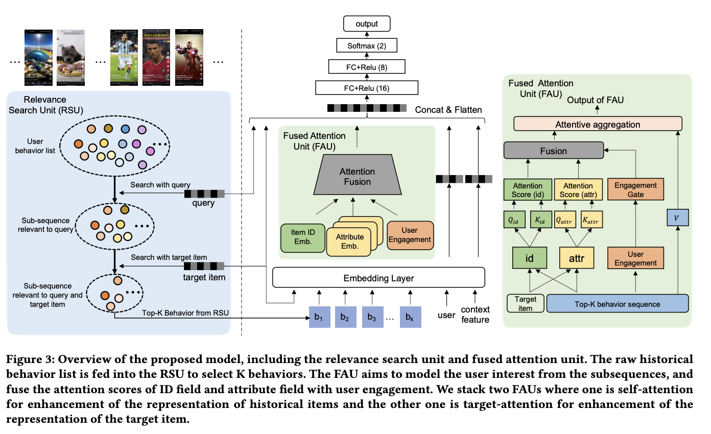

# Query-dominant User Interest Network for Large-Scale Search Ranking

# 标题
- 参考论文：Query-dominant User Interest Network for Large-Scale Search Ranking
- 公司：Kuaishou
- 链接：https://arxiv.org/pdf/2310.06444
- Code：
- 时间：2023
- `泛读`

# 内容

## 摘要
- 问题：
  - 在个性化搜索排序（PSR）中，用户的搜索行为通常非常稀疏，难以捕捉长期兴趣；而包含推荐在内的全量行为虽然丰富，但对特定搜索请求而言噪声巨大。
- 方法：
  - QIN设计了两级级联结构：
    - 相关性搜索单元（RSU）：先根据当前查询筛选出相关的行为子序列，再在该子序列中根据目标商品进一步筛选出更精细的子子序列，实现对长期行为的逐步过滤。
    - 融合注意力单元（FAU）：将ID类特征与属性类特征分开计算注意力分数，再根据用户近期的交互强度自适应融合，形成最终的物品表示与用户兴趣

## 1 INTRODUCTION
- 问题：
  - 整体行为噪声大：
    - 用户可能看了大量与当前搜索无关的内容（例如平时喜欢看美食视频，但当前搜索“足球”），直接使用整体行为会引入干扰。
  - 搜索行为稀疏：
    - 用户很少重复搜索同一个查询，导致纯搜索行为序列难以支撑个性化建模。
  - 迁移挑战：将序列推荐技术直接用于搜索面临两大难点：
    - 相关性缺失：全量行为可能与当前查询完全无关，直接建模会引入干扰。
    - ID特征稀疏：搜索涉及“用户-查询-物品”三元组，且对于特定查询，历史行为中的物品ID与当前候选物品ID可能极少重叠，必须结合属性特征和参与深度（如观看时长）来增强表达
    - 用户交互深度差异：对于同一物品，用户可能只是快速划过，也可能长时间观看或互动，这种深度差异应体现在兴趣权重中。
- 方法：
  - QIN采用两阶段级联结构，逐步过滤噪声并精细建模兴趣。
  - 相关性搜索单元（RSU）：RSU的目标是从用户整体历史行为中，高效筛选出与当前搜索请求真正相关的子序列。它分为两级搜索：
    - 第一级：查询级搜索：
      - 以当前查询为条件，从用户全部历史行为中检索出与之相关的一个较宽的子序列。这一步使用倒排索引或快速匹配，过滤掉明显无关的交互（例如用查询词与历史行为中的文本/类目进行匹配），得到初步的相关行为集。
    - 第二级：目标商品级搜索：
      - 在上一级得到的子序列中，进一步以当前候选商品为条件，检索出与该商品更为相关的子子序列。这一步通常采用更精细的相似度计算（如嵌入内积），确保最终入选的行为是与当前预测目标高度相关的。
  - 融合注意力单元（FAU）：FAU负责对筛选出的行为序列进行兴趣聚合。它针对搜索场景下ID稀疏、属性重要的特点，做了三项创新设计：
    - ID与属性分离计算：
      - 将历史行为中的物品ID特征与属性特征（如类目、标签、文本描述等）分别输入两个独立的注意力网络，各自计算与当前查询和候选商品的注意力权重。这样即使ID不匹配，属性相似仍能传递有效信号。
    - 自适应融合：
      - 对ID和属性两个注意力分支输出的权重进行动态融合。融合系数由用户与物品的交互深度（如观看时长、点击次数、完播率等）决定。交互越深，该物品的总体权重越高；反之，即使属性相似，若用户只是快速划过，权重也会相应降低。
    - 用户兴趣表示：
      - 最终将加权后的ID嵌入与属性嵌入拼接，作为该行为项的表示，再经加权池化得到用户兴趣向量，用于后续CTR预测。
- **主要贡献**：
  - 解决稀疏与噪声的矛盾：
    - 针对个性化搜索排序（PSR）中搜索行为稀疏和全量行为噪声大的痛点，首次提出整合搜索与推荐的全量长短期行为来捕捉用户偏好，并展示了其在提升用户参与度方面的显著潜力。
  - 创新的两阶段注意力架构：
    - RSU（相关性搜索单元）：通过两阶段过滤（查询词检索+目标物品筛选），从冗余行为中提取相关子序列，有效抑制了非搜索行为带来的噪声。
    - FAU（融合注意力单元）：利用内容属性弥补 ID 特征的稀疏性，并引入用户参与深度（如视频观看时长）作为门控，动态融合两者的注意力权重。
  - 卓越的工业级成效：通过在快手搜索系统（服务数亿用户）的 A/B 测试证明，QIN 相比高度优化的生产环境基准模型，点击率（CTR）提升了 7.6% 。
- **本质上是对过去的行为进行高效过滤，并且提出一个更加合适的兴趣注意力提取器**

## 2 RELATED WORK

### 2.1 Personalized Search Ranking
- 现有方法主要分为两个技术方向：
  - 基于图的方法：侧重于扩展用户的潜在兴趣。例如 IHGNN 通过构建交互超图来增强物品的嵌入表达。
  - 基于注意力机制的方法：捕捉用户历史行为中的偏好模式。
  - 共同局限：这些方法大多仅利用历史搜索行为来建模，忽略了更丰富的全量行为数据，意思是用户的所有过去行为而不仅仅是搜索行为。

### 2.2 User Interest Model
- 架构演进：涵盖了从 DNN、CNN、RNN 到 Transformer 的多种架构。
- 注意力机制：
  - SASRec 证明了自注意力机制在序列建模中的领先性能。
  - DIF-SR 提出了将侧边信息（Side Information）与 ID 特征解耦计算，以避免注意力矩阵的低秩瓶颈。
- QIN 的突破：在这些基础上，QIN 引入了长短期兴趣的分离建模，并专门针对搜索场景优化了注意力融合机制。

## 3 PRELIMINARIES

### 3.1 Task Formulation
- 将个性化搜索排序（PSR）定义为预测用户 u 在搜索查询 q 时点击目标物品 i 的概率

### 3.2 Inherent Bottleneck in Search Behavior
- 极其稀疏：在实际场景中，大多数查询对特定用户而言是全新的，用户的搜索历史往往过于贫瘠，难以支撑长期的兴趣表征。
- 数据差距：快手的数据分析显示，推荐行为序列的平均长度是搜索行为的 20 倍。这种显著的规模差异表明，仅依赖搜索行为会造成严重的兴趣建模“瓶颈”。
- 核心矛盾：虽然利用全量行为可以缓解稀疏性，但长序列数据对当前的瞬时搜索而言充满了无关的噪声。
- **问题本质：搜索行为不够用，全量行为噪声多**

## 4 METHODOLOGY

    
      <figcaption style="text-align: center">
        QIN 模型结构
      </figcaption>
    </img>
  

### 4.1 Relevance Search Unit
- RSU 采用 级联过滤 的方式，逐步缩小行为范围：
- 第一级：查询级检索：
  - 输入：用户查询 q，用户完整历史行为列表 B = [b_1, b_2, ..., b_T]。
  - 操作：计算每个行为 b_t 与查询 q 的相关性得分 r^{q}_{b_t}。
  - 输出：得分最高的 Top‑K_1 个行为，形成子序列 B^{q}。
  - 目的：快速过滤掉与查询语义无关的绝大部分行为，保留可能与当前搜索相关的候选行为。这一步大大扩展了纯搜索行为集（因为原本可能只有少量搜索记录），且不会引入明显负作用。
- 第二级：目标商品级检索：
  - 输入：第一级得到的子序列 B^{q}，以及当前需要打分的候选目标商品 i。
  - 操作：计算 B^{q} 中每个行为与目标商品 i 的相关性得分。
  - 输出：得分最高的 Top‑K_2 个行为，形成子子序列 B^{i}，其中 K_2 < K_1。
  - 目的：在同一查询下，不同候选商品往往需要不同的历史行为来支撑兴趣判断。例如，查询“连衣裙”时，候选商品“碎花连衣裙”与“纯色连衣裙”可能对应不同的历史观看或点击记录。第二级检索让模型能够根据具体目标商品进行更精细的筛选，提升了同一搜索会话内对不同候选的区分能力。
- 相关性计算与语义空间对齐：
  - 查询 q 和物品 b_t 属于不同类型的实体，无法直接计算相似度。RSU 采用 预训练嵌入 将二者映射到同一个语义空间：
  - 嵌入来源：使用大规模预训练模型（如多模态检索模型）生成的向量表示。论文中提及了两种来源：[29] 的基础模型和 [30] 的升级版多模态模型。
  - 计算方式：在统一的嵌入空间中计算查询与行为物品之间的相似度（例如内积或余弦相似度），作为相关性得分 r^{q}_{b_t}。
  - 个性化视角：即使同一查询 q，不同用户的兴趣偏好也可能不同。预训练嵌入能够捕获查询与物品之间的语义匹配程度，同时结合用户个性化信息，实现更精准的相关性判断。

### 4.2 Fused Attention Unit

#### 4.2.1 Prior Attention Calculation
- 问题：
  - 传统多头注意力将ID和属性特征混合，会因注意力矩阵秩不足而降低性能。
  - 以往认为“ID 特征优于属性特征”的研究不同，模型发现两者在特征质量较低的长尾场景下具有极强的互补性，FAU 实现了 ID 字段与属性字段的解耦计算，并进行自适应融合。
  - **本质上也就是拆成独立的多个sequence，而不是合在一起**
- 公式：
  - ID注意力：att_ID_h = (R_ID * W_Q_ID) * (R_ID * W_K_ID)^T / √d
  - 属性注意力：att_attr_h = (R_attr * W_Q_attr) * (R_attr * W_K_attr)^T / √d
  - R_ID 和 R_attr 分别为ID和属性字段的embedding
  - **本质上就是多头注意力的第一步，计算attention的时候
- 数学原因：
  - 根据矩阵秩的性质：两个矩阵乘积的秩，不会超过其中任何一个矩阵的秩。rank(QK^T) <= min(N, d_k)
  - 秩的大小本质上，就是矩阵中线性无关（即不重复、不冗余）的行或列的最大数量。在 machine learning 中 秩 = 表达能力的上限。
  - 在工业界，为了计算效率，每个头的投影维度 d_k（Head Projection Size）通常设得很小（如 32 或 64），而特征序列或特征组合的数量 $N$ 可能远大于此。
  - 这意味着： 尽管你的注意力矩阵是 N * N 的，但它在数学上被限制在一个极低维的子空间里。它无法表达 N * N 维空间中所有复杂的依赖关系。
- 物理意义：
  - 高秩（High Rank）： 意味着网上的每一个节点都可以有自己独特的连接方式，每一行都提供了全新的、无法被其他行推导出来的独特信息。模型可以同时记住“用户喜欢这双鞋的颜色”和“用户喜欢那个品牌的价位”。
  - 低秩（Low Rank）： 意味着很多节点的连接方式必须是线性相关的，矩阵中存在大量的冗余，第一行和第二行说的是一个东西。这就像是在一个派对上，如果秩太低，所有人的社交关系都被迫简化成了几种固定的“套路”，无法捕捉到每个人之间细微、独特的互动。
  - 在处理 ID 特征（极其稀疏、个性化）和 属性特征（高度泛化、共享）时：
    - ID 特征需要“点对点”的精确匹配（高秩）。
    - 属性特征通常表现为“类簇”式的匹配（低秩）。
    - 当两者被强行挤进一个低秩的注意力矩阵时，属性特征的“大信号”会迅速占据有限的秩空间，导致 ID 特征中那些细微但关键的个性化信号被当作“噪音”过滤掉。
- 搜索排序中的具体影响：
  - Head Projection 的制约在搜索排序中，我们将 ID 和属性直接合并计算，会产生以下两个直接后果：
    - 注意力坍缩（Attention Collapse）由于 d_k 的限制，注意力矩阵倾向于学习到一些“平均化”的权重。这会导致模型对所有 Item 的排序倾向变得雷同，无法根据长尾 ID 做出微小的排序调整。
    - 多头注意力的局限性虽然多头（Multi-head）是为了通过多个低秩矩阵的组合来提升总秩，但如果每个头都在关注相似的属性特征（因为属性信号最强），那么总体的**有效秩（Effective Rank）**依然很低。

#### 4.2.2 Fusion with User Engagement
- 用户对历史物品的参与程度（如观看时长、点击次数）反映了其情感粘性。FAU通过一个门控网络生成融合权重
- Gate = σ(W2 · ReLU(W1 · R_ED))，其中 R_ED 是用户参与度特征嵌入
- 融合后的注意力分数为：att_fused_h = Gate ⊙ (α·att_ID_h + (1-α)·att_attr_h)
- 这里 α 是超参数，控制ID特征的重要性（设为1时仅用ID，梯度停止）。⊙ 表示逐元素乘积，使得深度参与的历史物品获得更高权重。
- **本质上也就是，用一个用户参与层度来控制 ID 和 属性的注意力融合。这里可以延伸出不同的门控机制来实现 sequence 融合**

#### 4.2.3 Attentive Aggregation
- 使用 att_fused_h 替换传统注意力分数，计算每个头的输出：head_h = softmax(att_fused_h) · V_h
- 各头输出拼接后更新行为序列中物品的表示。
- 堆叠一个 target attention，以目标物品及其内容特征为查询，对FAU增强后的序列进行加权
- 最终将序列嵌入展平，与用户、查询嵌入拼接，经MLP输出CTR预测
- **本质上就是把 self-attention 给改了，计算 attention 的时候用的是 FAU 思路，然后再接一个 DIN。**

### 4.3 Model Analysis

#### 4.3.1 Relation with SIM
- QIN 借鉴了 SIM 利用全量行为的思想，但针对搜索场景做了关键改进：
  - 避免嵌入漂移：SIM 强依赖目标物品进行检索，这在搜索中可能导致“嵌入漂移”。QIN 坚持查询词主导（Query-dominant），确保检索到的行为不仅与物品相关，更要符合当前的搜索意图。
  - 突破硬检索限制：在内容分享平台（如快手），物品类别极度多样且模糊，SIM 常用的“硬检索”（基于类别 ID 匹配）效果有限。QIN 采用预训练嵌入向量计算相关性，能够更灵活、精准地匹配复杂内容。

#### 4.3.2 Relation with DIF
- QIN 和 DIF 都采用特征解耦，但 QIN 引入了用户参与深度门控：
  - 可解释性更强：相比于 DIF 纯靠模型学习的参数，观看时长等“参与深度”能更直观地反映用户对物品的真实偏好。
  - 捕获高阶交互：用户可能因为各种原因“误点”视频，但决定是否“持续观看”则反映了深度特征交互。QIN 利用这一信息作为门控，引导模型过滤点击噪声，聚焦于用户的“真爱”行为，从而有效防止过拟合。
- **本质上是因为有的历史item可能和query相关也可能和候选item相关，但是可能是用户误点击的，或者不那么感兴趣的，用一个用户参与度来作为门，有效筛选更喜欢的item**

### 4.4 Training
- CE Loss

### 4.5 Online Serving
- 两阶段 RSU 的必要性与复杂度分析
  - 模型没有采用直接针对目标物品进行全量检索的“一阶段 RSU”，是因为其计算成本过高。
  - 复杂度对比：
    - 一阶段（目标物品驱动）：复杂度为 O(NMD)。在目标物品数 M 达到数百，且历史行为数 N 极大的情况下，计算压力巨大。
    - 两阶段（QIN 方案）：通过先用查询词过滤出较短的序列 K1，复杂度降为 **O(ND + MK1D)**。
  - 结论：由于 N >> K1，两阶段设计显著减轻了系统负担，使得在线实时推理成为可能。
- 工程优化细节
  - 为了进一步压缩耗时，QIN 在工程层面实施了多项策略：
    - 去重优化：在存储行为序列时执行去重操作，剔除约 10% 的冗余项，仅保留最近记录，从而节省存储并提升检索效率。
    - 高性能存储：行为特征（如参与度、时间戳）和多模态嵌入向量均存储在 Key-Value 结构的服务器中，实现极速读取。
    - 计算加速：针对最耗时的点积运算（Dot Product），系统采用了并行计算范式进行加速。

## 5 EXPERIMENTS

### 5.1 实验设置 (Experimental Settings)
- 数据集 (5.1.1)：采用 Amazon 的四个子集（Beauty, CDs & Vinyl, Electronics, Kindle Store），通过 leave-one-out 策略进行评估，即最后两个交互项分别用于验证和测试。
- 对比方法 (5.1.2)：涵盖了基础 PSR 模型（如 HEM、ZAM、TEM）、基于图的方法（GraphSRRL、IHGNN）以及当前最强的基准 MultiResAttn。
- 评价指标 (5.1.3)：使用 NDCG@N、HR@N 和 MRR@N（N 选自 {4, 8, 20}），以顶级指标为核心参考。
- 实现细节 (5.1.4)：模型基于 TensorFlow 开发，Embedding 维度设为 8，通过 Adam 优化器在 78 核 CPU 环境下利用 Horovod 加速训练。

### 5.2 性能对比 (Performance Comparison)
- 显著领先：QIN 在所有数据集上均大幅优于基础 PSR 模型，且相比最强基准 MultiResAttn 平均提升了 21.19%。
- 图模型局限：实验发现基于图的方法在处理包含许多新节点的测试集时表现不佳，出现明显的性能退化。

### 5.3 消融实验 (Ablation Studies)
- RSU 影响 (5.3.1)：对比单阶段检索，两阶段 RSU 效果最佳。虽然仅根据目标物品检索的 RSU 也能提供个性化偏好，但在实时搜索系统中因复杂度过高而无法部署 。
- FAU 影响 (5.3.2)：验证了“用户参与度”作为门控的有效性。QIN 优于 DIF（无参与度）和 QINid（无属性特征），证明 ID 与属性特征在长尾场景中具有高度互补性。
- 参数敏感度 (5.3.3 & 5.3.4)：
  - 更大的 Embedding 并不总是带来提升
  - 而序列长度过长（超过实际历史行为数）会引入噪声，导致模型表现下降。
  
### 5.4 超参数研究 (Hyper-parameter Studies)
- 核心超参数是 α（平衡 ID 与属性重要性）。实验显示在 α=0.5 左右性能达到峰值，说明两类特征在搜索建模中同等重要。
  
### 5.5 线上评估 (Online Evaluation)
- 工业增量：QIN 在快手搜索系统上线一个月，覆盖超过 1 亿次查询。
- 业务指标：CTR 提升了 7.6%，代表视频深层参与的“高效观看”提升了 24.1%，用户满意度显著增强。

## 6 CONCLUSION AND FUTURE WORK
- 总结：
  - QIN 通过 RSU（相关性搜索单元） 的两阶段过滤（先查询后目标物品）和 FAU（融合注意力单元） 的解耦融合机制，成功解决了搜索行为稀疏和长序列噪声的问题
- 未来研究方向：
  - 即时兴趣（Instant Interest）：计划探索更实时的兴趣捕捉，以优化瞬时搜索预估。
  - 负反馈引入：考虑将用户的负反馈信号（如跳过视频）纳入模型，从而更全面地建模用户参与度。

# 思考

## 本篇论文核心是讲了个啥东西
- 提出相关性搜索单元（RSU）：负责为查询和每个候选商品，从用户全量历史中快速筛选出最相关的子序列。
  - 第一级：以用户当前查询为基准，筛选出Top-K1相关行为，在保留与查询语义相关的信息的同时，有效过滤了大量无关噪声。
  - 第二级：对于每个具体的待打分商品，从第一级结果中进一步筛选出Top-K2个与其最相关的行为。
- 融合注意力单元（FAU）：负责对RSU筛选出的高纯度子序列进行精细建模，以最终的用户向量进行CTR预估。
  - 解耦注意力：将ID特征和属性特征分开计算注意力分数，在搜索场景下当ID匹配稀疏时，属性特征能起到关键的补充作用。
  - 用户参与度融合：引入用户的历史参与度信息（如观看时长、点击率等），动态调整最终注意力权重，让模型对用户真正“沉浸”过的行为给予更高关注

## 是为啥会提出这么个东西，为了解决什么问题
- 问题：
  - 用户整体历史行为（如浏览、点击）虽然丰富，但大部分与当前搜索意图无关，直接使用会引入大量噪声。
  - 纯搜索行为虽然相关性强，但数据过于稀疏，很少重复搜索同一个查询，导致模型难以充分学习。
- 方法：
  - RSU通过两级检索，精准捕获了与当前查询和候选商品均高度相关的历史行为。过滤噪音。
  - FAU通过解耦ID和属性特征，弥补了搜索场景下ID匹配稀疏的不足。长尾分布的问题。
  - 同时用户参与度信息的引入，确保了模型能聚焦于真正反映用户偏好的高质量行为。

## 为啥这个新东西会有效，有什么优势
- 两阶段过滤 (RSU)：先用 Query 过滤出相关行为，再用目标物品进一步精筛，实现了“查询主导”的去噪，且计算复杂度更低。
- 特征解耦 (FAU)：将 ID 和属性特征分开计算注意力，避免了“秩瓶颈”问题，两者在长尾场景下能形成互补。
- 参与度引导：引入观看时长等作为门控，自动强化“深度交互”的物品权重，过滤无效点击。

## 与此论文类似的东西还有啥，相关的思路和模型
| 模型                                               | 核心思路                                       | 与QIN的关系                                           |
|:-------------------------------------------------|:-------------------------------------------|:--------------------------------------------------|
| **DIN (Deep Interest Network)**                  | 引入目标注意力机制，让模型动态关注历史行为中与当前商品相关的部分。          | QIN的FAU单元可视为对DIN的精细化改进，增加了属性特征解耦和用户参与度融合。         |
| **SIM (Search-based Interest Model)**            | 通过“通用搜索单元（GSU）”和“精确搜索单元（ESU）”两级检索来筛选长序列行为。 | QIN的RSU单元与SIM的整体思路一致，但QIN更侧重于处理搜索场景下的“噪声”和“稀疏”问题。 |
| **SDIM (Sampling-based Deep Interest Modeling)** | 使用哈希采样替代显式检索，将行为序列建模为概率计算问题。               | 与QIN的RSU同属于“先筛选后建模”的范式，但核心实现方式不同。                 |
| **ETA (End-to-end Target Attention)**            | 使用局部敏感哈希（LSH）将内积计算转为汉明距离，实现端到端的超长序列建模。     | 与QIN、SIM一样，都致力于解决长期行为序列的建模难题。                     |

## 论文有什么可以改进的地方，可以后续继续拓展研究
- 引入更先进的检索技术：RSU的检索环节可以引入ETA的SimHash方法或SDIM的哈希采样方法，进一步提升检索效率。
- 即时兴趣（Instant Interest）：计划探索更实时的兴趣捕捉，以优化瞬时搜索预估。
- 负反馈引入：考虑将用户的负反馈信号（如跳过视频）纳入模型，从而更全面地建模用户参与度。
- 探索多模态特征：目前FAU主要处理ID和属性特征，未来可融入视频、图像等多模态信息。
- 与更高效的模型架构结合：QIN可作为基础的用户建模模块，与[PR](https://export.arxiv.org/pdf/2409.11281)等更新颖、更高效的个性化搜索框架或多任务学习框架进行结合。

## 在工业上通常会怎么用，如何实际应用
- RSU 可以参考，特别是 query 阶段的过滤，item 也可以考虑如果变长了sequence
- FAU 完全可以考虑，只是融合层需要替换掉观看时长，变成电商领域衡量用户engagement的特征
- ID 和 属性分离，已经尝试过，效果很好。

## 参考
- https://zhuanlan.zhihu.com/p/673033160