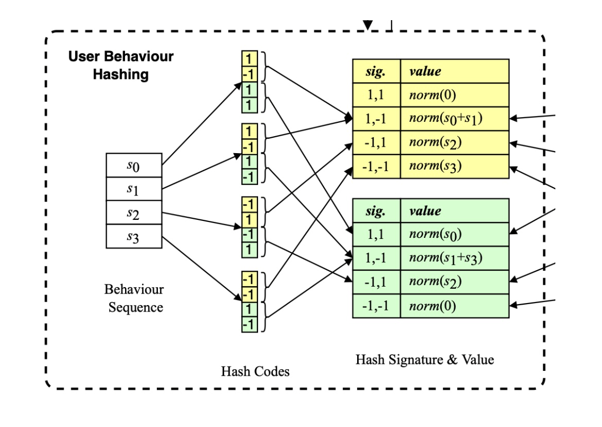
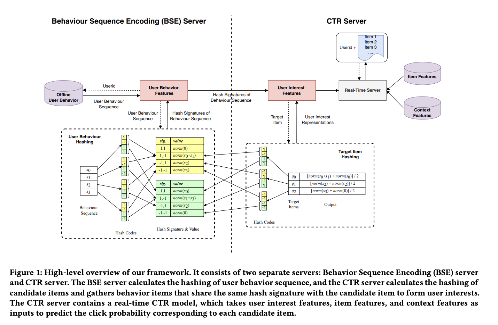
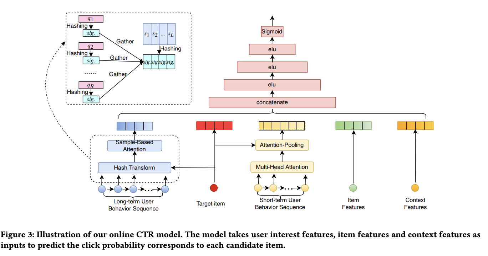

# Sampling Is All You Need on Modeling Long-Term User Behaviors for CTR Prediction

# 标题
- 参考论文：Sampling Is All You Need on Modeling Long-Term User Behaviors for CTR Prediction
- 公司：Meituan
- 链接：https://arxiv.org/pdf/2205.10249
- Code：https://github.com/reczoo/FuxiCTR/blob/main/model_zoo/LongCTR/SDIM/SDIM.py
- 时间：2022
- `泛读`

# 内容

## 摘要
- 问题：
  - 长序列行为数据对 CTR 预估极具价值，但受限于在线推理延迟。
  - 现有方法多采用“检索式策略”（Retrieval-based），仅提取一小部分行为进行计算， 但指出这种方式是次优的，容易造成严重的信息损失。
- 方法：
  - 提出了一种基于哈希采样的端到端建模方法 SDIM
  - 通过多个哈希函数生成候选物品和历史行为的“哈希签名”，直接将具有相同签名的行为聚集起来提取兴趣，而无需计算复杂的注意力权重。
- 效果：
  - 精度对齐：在理论和实验上证明，该方法的效果与标准的 Target Attention 模型持平。
  - 效率极高：推理速度比传统模型快数倍
  - 设计独立的 BSE（行为序列编码）服务器，将最耗时的哈希计算与 CTR 预估解耦，使得 CTR 服务器几乎实现了“零延迟”的长序列处理。

## 1 INTRODUCTION
- 问题：
  - 长序列的信息潜力：
    - 工业场景中用户行为序列越来越长（美团60%用户年行为超1000条，10%的用户甚至超过5000条），但受在线延迟限制，传统DIN只能截取最近50条，造成信息损失。
  - 检索式方法的缺陷：
    - 信息损失与估计偏差：SIM、UBR4CTR 和 ETA 等方法先检索 top−k 相关行为再建模。仅提取极少部分行为是次优的，会导致严重的兴趣表示不准和信息丢失。
    - 效能平衡难题：简单的检索（如 SIM 硬件过滤）效果有限；复杂的检索（如 UBR4CTR）虽然精度高，但推理速度慢了 4 倍，难以在线部署。
    - **本质上检索的问题在于：对于行为丰富的用户，应该取较大的 k 从而捕获所有的informative 行为；对于行为很少的用户，应该采用较小的 k 从而过滤掉噪音。但是实际应用中，k 是全局统一的**
- 方法：
  - 不再检索Top-K，而是直接对所有行为进行哈希采样
  - 哈希签名生成：使用多个随机哈希函数，为目标物品和序列中每个行为生成哈希签名
  - 兴趣聚合：直接收集所有与目标物品哈希签名相同的行为，将这些行为的embedding进行聚合（加权求和或平均），形成用户兴趣表示
  - 理论支撑：证明这种采样方式等价于用LSH碰撞概率近似softmax分布，从概率角度逼近全量目标注意力的效果
  - **本质上是：利用多轮哈希函数生成的碰撞概率来模拟标准 Target Attention（历史行为序列根据 attention score 计算出来的权重）的分布，直接从全量序列中聚合兴趣，从而实现无损建模**
- 优势：
  - 无信息损失：不再截断为Top-K，所有与目标“碰撞”的行为都会被纳入，避免单一偏好偏差
  - 极致效率：哈希碰撞判断是O(1)位运算，复杂度从检索的O(L·B)降至O(L)，且高度可并行
  - 端到端一致性：哈希直接作用于模型当前embedding，无离线索引陈旧问题
- 工业部署实践：
  - SDIM在美团将框架解耦为两个独立服务：
    - BSE（行为序列哈希）服务：预计算用户行为序列的哈希签名，离线/准实时更新
    - CTR服务：在线接收请求后，直接从BSE读取签名并完成碰撞聚合
  - 这种解耦使最耗时的哈希计算部分与主请求分离，线上延迟可控。目前已部署于美团搜索系统，带来CTR +2.98%，VBR +2.69% 的显著业务提升。
- **主要贡献**：
  - 提出了 SDIM ，一个 hash sampling-based 的框架，用于为 CTR prediction 建模长期用户行为。证明了这种简单的 sampling-based 的策略产生了与 target attention 非常相似的注意力模式。
  - 详细介绍了在线部署 SDIM 的实践。
  - 在公共数据集和行业数据集上进行了大量实验，结果证明了 SDIM 在效率和效果方面的优越性。SDIM 已经部署在美团的搜索系统中，为业务做出了重大贡献。
  - **本质上就是用 LSH 实现了 target attention 并且替代了**

## 3 PRELIMINARIES

## 3.1 Task Formulation
- CTR 预估
- Cross-entropy loss

## 3.2 Target Attention
- 核心思想是：
  - DIN 提出，将目标物品作为查询（Query），将用户行为序列中的每个物品作为键（Key）和值（Value），通过注意力机制从序列中软性地检索与目标相关的部分，再加权求和得到用户兴趣表示。
- 数学表达：
  - 单目标：TA(q_i, S) = Σ (softmax(q_i^T * s_j / t) * s_j)
  - 矩阵形式：TA(Q, S) = softmax(Q^T * S / t) * S
  - 其中 t 为缩放因子，用于避免内积值过大。
- 计算复杂度与工业瓶颈：
  - 目标注意力的复杂度为 O(B·L·d)，其中：
    - B：每个请求需要打分的候选物品数量（工业中约10³）
    - L：用户行为序列长度
    - d：模型隐层维度（约10²）
  - 在线部署难题：
    - 由于 B 和 L 通常都很大，直接在长序列上运行 TA 会导致无法接受的推理延迟，因此大多数系统被迫将序列截断至 50 以内，造成信息损失

## 3.3 Locality-Sensitive Hash (LSH) and SimHash

    
      <figcaption style="text-align: center">
        SDIM_LSH例子
      </figcaption>
    </img>
  

- 核心思想：
  - LSH是一种在高维空间中高效寻找最近邻的算法，具有局部敏感性：相似的向量有高概率获得相同的哈希签名，而不相似的向量则几乎不会碰撞。用这种碰撞概率来近似 Target Attention 中的 Softmax 分布，从而避免了昂贵的点积运算
- SimHash:
  - SimHash通过随机投影将高维向量映射为二进制哈希码。对于一个输入向量 x 和随机投影向量 r，哈希码计算公式为 h(x, r) = sign(r^T * x)，输出为 +1 或 -1。
- 多轮哈希与参数化:
  - 单次哈希存在误差，实际中常采用 (m, τ) 参数化的多轮哈希：
    - 使用 m 个随机哈希函数，为每个输入生成 m 位哈希码
    - 将这 m 位码按每 τ 位一组进行聚合，形成多个最终的哈希签名
    - 碰撞条件：两个向量仅在某一组的所有 τ 位哈希码都相同时，才认为在该组上“碰撞”
- **本质上和ETA是一样的思路，只是ETA是碰撞后，提取和target item相似的 top k 行为 item，而这里是增加碰撞次数，直接模拟softmax分布**

## 4 METHODOLOGY

    
      <figcaption style="text-align: center">
        SDIM_模型结构
      </figcaption>
    </img>
  

### 4.1 User Behavior Modeling via Hash-Based Sampling

#### 4.1.1 Hash Sampling-Based Attention
- 核心:
  - SDIM不再像ETA那样先计算汉明距离再筛选Top-K，而是直接利用哈希碰撞概率来近似用户兴趣分布。
  - 利用LSH的局部敏感性，两个向量碰撞（获得相同哈希签名）的频率，可以近似表示它们的相似度。因此，可以直接将所有碰撞的行为embedding直接求和，作为用户兴趣表示，从而绕过显式的检索步骤。
- 数学形式:
  - 对于单个哈希函数 r，用户兴趣表示为：ℓ₂( Σ_{j=1}^{L} p_j^{(r)} · s_j )
  - 其中 p_j^{(r)} 是0/1指示变量：若第 j 个行为与目标物品哈希签名相同，则为1，否则为0。最后的 ℓ₂ 归一化用于模拟softmax的归一化效果，使兴趣向量模长为1。
- 优势:
  - 更高效的近似：碰撞判断是O(1)位运算，求和复杂度与碰撞数成正比，远低于ETA的检索+注意力开销
  - 无信息损失：不截断Top-K，所有与目标“碰撞”的行为都被纳入，避免因K值选择导致的信息丢失
  - 理论一致性：用碰撞概率近似softmax分布，从概率角度逼近全量目标注意力的效果

#### 4.1.2 Multi-Round Hashing
- 核心:
  - 由于LSH是概率性的，不相似的物品也有小概率与目标物品发生哈希碰撞，从而将噪声引入用户兴趣表示
- 方法：多轮哈希聚合
  - SDIM采用(m, τ)参数化的SimHash算法来降低这种噪声：
    - 并行采样：使用m个独立的哈希函数，并行地为每个物品生成m位哈希码。
    - 分组聚合：将每τ位哈希码合并成一个新的、更严格的哈希签名。
    - 碰撞条件升级：两个物品被认为“碰撞”的条件不再是单次哈希相同，而是需要在同一组内的所有τ位哈希码都完全相同。
  - 这种分组策略本质上增加了碰撞的“特异性”——只有真正相似、在多个投影方向上表现一致的物品才能通过筛选，从而有效过滤掉因单次随机投影产生的偶然碰撞噪声。
- 低方差估计：
  - 最终，SDIM会生成m/τ组独立的聚合签名。模型将这多组签名的碰撞结果取平均，作为最终的用户兴趣估计。数学表达为：
  - Attn(q, S) = (1/(m/τ)) Σ ℓ₂( Σ p̃_j^(Ri) s_j )

### 4.2 Analysis of Attention Patterns

#### 4.2.1 Expectation of Hash Sampling-Based Attention
- 碰撞概率与相似度的关系：
  - 根据LSH理论，两个单位向量 q 和 s_j 在单次哈希中碰撞的概率，等于它们在单位圆上夹角的线性函数：1 - arccos(q^T s_j)/π。
  - 经过 τ 次哈希分组后，碰撞概率的期望为：E[p̃_j] = [1 - arccos(q^T * s_j)/π]^τ
- 期望形式的注意力：
  - SDIM生成的用户兴趣表示的期望为：E[Attn(q, S)] = Σ ( [1 - arccos(q^T * s_j)/π]^τ / Σ [1 - arccos(q^T * s_k)/π]^τ ) · s_j
  - 这正是一个以 [1 - arccos(q^T s_j)/π]^τ 为权重的softmax形式。
- 与目标注意力的对比：
  - 当 τ=1 时，权重为 1 - arccos(q^T * s_j)/π，是一个线性近似
  - 当 τ 增大时，该函数呈现指数衰减特性，越来越接近softmax的分布形状
  - 论文实验表明，当 m=48, τ=3 时，SDIM的权重曲线与目标注意力（exp(q^T * s_j/0.5)）高度吻合
- 收敛性与工程参数:
  - 随着哈希签名组数 m/τ 增加，估计值收敛于期望
  - 当 m/τ ≥ 16 时，估计误差已可忽略
  - 美团线上实际采用 m=48, τ=3（即16组签名），在效率与精度间取得良好平衡

#### 4.2.2 The Property of 𝜏 and Relation to Other Methods
- τ的作用:
  - τ越大，注意力分布熵越小，权重分布越集中在相似度高的区域，模型越“挑剔”
    - τ → +∞，只关注与目标完全相同的物品（同品类），类似SIM的硬搜索
  - τ越小，注意力分布越均匀，模型越“宽容”
    - τ = 0，所有物品权重相等，完全忽略相似度，类似平均池化
- 数学体现：
  - 注意力权重 wj 正比于碰撞概率的 τ 次方：[1 - arccos(q^T s_j)/π]^τ。这意味着 τ 越大，高相似度区域的权重增长越快

### 4.3 Implementation and Complexity Analysis
- Target Attention (TA) 的复杂度：
  - 计算公式：O(B×L×d)
    - B：候选物品数（约 10^3）
    - L：序列长度（约 10^3）
    - d：维度（约 10^2）
  - 瓶颈：TA 需要两次矩阵乘法（计算权重和加权求和），且计算过程强依赖于目标物品，这意味着对于 B 个候选物品，必须重复计算 B 次
- SDIM 的复杂度优化：计算解耦
  - SDIM 将计算拆分为两部分，彻底消除了 B 与 L 的乘积关系：
    - 行为序列哈希（一次性计算）：由于用户行为序列与候选物品无关，系统在每次请求中只需计算一次序列哈希。其复杂度通过“近似随机投影”算法可优化至 O(L⋅mlogd)。
    - 目标物品哈希：复杂度仅为 O(B⋅mlogd)。
    - 极速聚合：由于 m（哈希数，约 48）远小于 B（候选物品数，约 1000），且 logd 远小于 d，总计算量大幅下降。

### 4.4 Deployment of the Whole System

    
      <figcaption style="text-align: center">
        SDIM_在线系统
      </figcaption>
    </img>
  

- 双服务器架构：为了解决计算效率问题，系统被拆分为两个独立部分：
  - BSE 服务器（行为序列编码）：专门负责最耗时的行为序列哈希计算。它将用户的历史行为根据哈希签名分配到不同的“桶（Buckets）”中。
  - CTR 服务器：负责实时预估。它只需对候选物品进行哈希，并从 BSE 传来的桶中直接提取（Gather）对应的兴趣特征。
- 计算解耦与并行化：
  - 由于用户行为哈希与特定的候选物品无关，BSE 的计算可以与推荐系统的检索模块并行执行。这意味着对 CTR 服务器来说，长序列处理的延迟几乎为零，处理万级序列就像增加一个普通特征一样简单。
- 传输效率优化：
  - 为了降低服务器间的通信开销，BSE 仅传输固定长度的桶表示向量（在美团线上约为 8KB），每次请求的传输耗时仅约 1ms。
- 端到端训练 vs. 分离部署：
  - 虽然在线上是分开部署的，但在训练阶段，整个框架是端到端联合训练的，确保了检索逻辑与预测目标的高度一致

## 5 EXPERIMENTS
- 精度对齐：SDIM 的 AUC 表现与 DIN (Long Seq.) 基本持平，甚至在 Taobao 数据集上略优（0.8854 vs 0.8848），证明了采样法能有效模拟标准注意力机制。
- 超越检索法：SDIM 的效果显著优于 SIM、UBR4CTR 和 ETA。作者认为这是因为检索式方法只提取 top−k 项会造成信息丢失，而 SDIM 实现了“无损”建模。
- 极速推理：在工业数据集上，SDIM 的训练/推理速度是 DIN (Long Seq.) 的 11.4 倍。相比同样使用 LSH 的 ETA，SDIM 依靠 Gather 算子避开了汉明距离计算和 Top-K 排序，效率更高。

## 6 RESULTS AND ANALYSIS
- 离线实验结果 (6.1 & 6.2)：
  - Taobao 数据集：SDIM 的 AUC（0.8854）与全量建模的 DIN (Long Seq.) 持平，且显著优于 SIM、UBR4CTR 和 ETA 等检索式方法。性能提升源于 SDIM 避免了检索过程中的信息损失。
  - 工业数据集：SDIM 在美团百亿级样本上展现出更强的优势，AUC 领先检索式模型约 1.38%~2.08%。
  - 效率飞跃：在两个数据集上，SDIM 的训练与推理速度分别是对比模型的 5 倍和 11.4 倍。
- 超参数消融实验 (6.3)：
  - 哈希数量 m (6.3.1)：随着 m 增加，估算误差减小。实验发现当 m>48 时，AUC 提升趋于平稳，因此生产环境采用 m=48 以平衡精度与效率。
  - 签名宽度 τ (6.3.2)：控制注意力的集中度。τ 过小（如 1）会引入噪声，过大（如 10）则过于严苛。实验表明 2≤τ≤5 表现最佳，最终选定 τ=3。
- 短序列验证与在线 A/B 测试 (6.4 & 6.5)：
  - 短序列表现：即使在短序列（T=16）任务中，SDIM 也能达到与标准 Target Attention 相当的精度，且速度快 2 倍。
  - 美团线上实测：SDIM(T=2000) 在美团搜索系统上线后，CTR 提升了 2.98%，VBR 提升了 2.69%。
  - 推理延迟：相比不带长序列的基准模型，SDIM 仅增加了 1ms 的延迟（主要是 BSE 与 CTR 服务器间的传输耗时），而标准 Target Attention 会增加约 50% 的延迟，无法满足上线要求。

## 7 CONCLUSIONS
- 总结：
  - SDIM 抛弃了复杂的长序列检索模块，转而采用一种基于哈希采样的方法。它通过直接收集（Gather）与候选物品具有相同哈希签名的行为来构建用户兴趣。
  - 性能与效率平衡：实验证明，该方法在建模精度上与全量建模的 DIN (Long Seq.) 持平，但在速度上实现了数倍的提升。
  - 工程部署验证：通过将行为序列哈希从 CTR 模型中解耦，SDIM 实现了在线预估的“零延迟”。目前，该系统已成功服务于美团 APP
- 未来：
  - 进一步降低服务器间的传输成本。
  - 探索更复杂的结构，例如引入 **多头哈希（Multi-head hashing）** 机制

# 思考

## 本篇论文核心是讲了个啥东西
- SDIM（Sampling-based Deep Interest Modeling）提出了一种基于哈希采样的用户兴趣建模框架
- 其核心思想是：不再通过检索Top-K相似行为再计算注意力，而是直接利用局部敏感哈希（LSH）的碰撞概率来近似目标注意力的softmax分布，将所有与目标物品哈希碰撞的行为embedding直接聚合，形成用户兴趣表示。
- 该方法在保持与标准目标注意力相近效果的同时，将计算复杂度从 O(B·L·d) 降至近似 O(B·d) 的位运算级别

## 是为啥会提出这么个东西，为了解决什么问题
- 问题：
  - 传统DIN类模型受在线延迟限制只能截取最近50条，造成信息损失。
  - 现有长序列方案存在根本缺陷：
    - 两阶段检索框架存在信息鸿沟，检索目标与CTR目标不一致
    - 提取一小部分 Top@k 行为进行计算，会造成信息丢失
- 方法：
  - SDIM，用局部敏感哈希（LSH）的碰撞概率来近似目标注意力的softmax分布，直接利用所有信息

## 为啥这个新东西会有效，有什么优势
- 无信息损失：不截断Top-K，所有与目标碰撞的行为都被纳入，避免因K值选择导致的信息丢失。
- 极致效率：哈希碰撞判断是O(1)位运算，复杂度从 O(L·B·d) 降至 O(L·B) 碰撞判断 + O(碰撞数·d) 求和，实际碰撞数远小于L。
- 理论一致性：证明在期望意义上，哈希采样注意力等价于softmax目标注意力，且通过调节宽度参数τ可平滑控制注意力锐度。
- 端到端同步：哈希直接作用于模型当前embedding，无离线索引陈旧问题。
- 灵活可调：通过τ可连续调节从“只关注完全相同物品”（SIM硬搜索）到“平均池化”之间的注意力模式。

## 与此论文类似的东西还有啥，相关的思路和模型
| 模型/方向        | 核心思想                | 与SDIM的关系                          |
|:-------------|:--------------------|:----------------------------------|
| **DIN**      | 目标注意力，但只能处理短序列      | SDIM将其扩展至超长序列，用哈希近似替换内积计算         |
| **SIM**      | 两阶段检索（硬/软搜索）+ 精排    | 存在信息鸿沟，SDIM用哈希碰撞替代检索，实现端到端无偏建模    |
| **UBR4CTR**  | 特征选择+倒排索引检索         | 检索模块复杂，延迟高；SDIM更简单高效              |
| **ETA**      | LSH+汉明距离检索Top-K再注意力 | SDIM进一步简化为直接聚合碰撞行为，无K截断，更高效       |

## 论文有什么可以改进的地方，可以后续继续拓展研究
- 模型角度：
  - 哈希函数的优化：当前使用固定随机投影，可探索学习型哈希，使碰撞分布更适配CTR任务。
  - 多粒度聚合：可结合不同τ值的多组签名，分别捕捉“严格相似”和“大致相似”的兴趣，融合后获得更丰富的表征。
  - 与短期序列的融合：SDIM主要处理长期序列，如何与短期序列（如最近50条）动态融合，可设计门控或自适应权重。
- 工程角度：
  - 在线增量更新：用户行为实时增加，如何高效更新哈希签名库，避免全量重算。
  - 可解释性：利用碰撞的行为作为推荐理由，分析哪些历史行为促成了当前推荐。

## 在工业上通常会怎么用，如何实际应用
- 长序列LSH的方式可以直接照搬，对应的 m 和 τ 值需要调参
- 短序列和大部分paper思路一样，可以复用
- 长序列用两个serve的方式也可以参考

## 参考
- https://www.huaxiaozhuan.com/%E6%B7%B1%E5%BA%A6%E5%AD%A6%E4%B9%A0/chapters/9_ctr_prediction8.html
- https://xiahouzuoxin.github.io/posts/%E8%B6%85%E9%95%BF%E8%A1%8C%E4%B8%BA%E5%BA%8F%E5%88%97%E5%BB%BA%E6%A8%A1sdim/
- https://zhuanlan.zhihu.com/p/525604184
- https://zhuanlan.zhihu.com/p/444198579