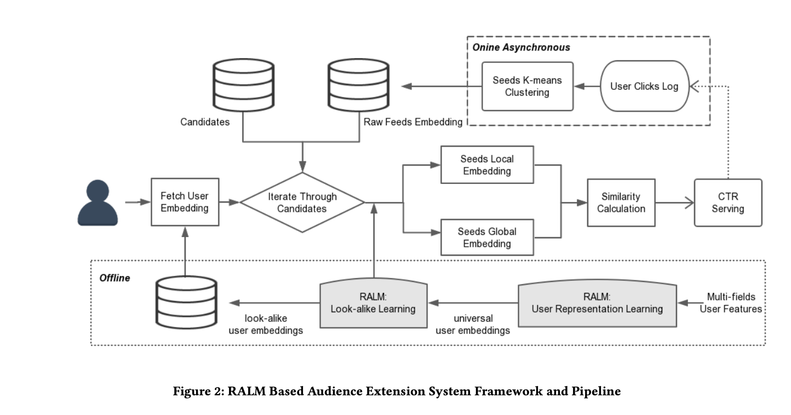
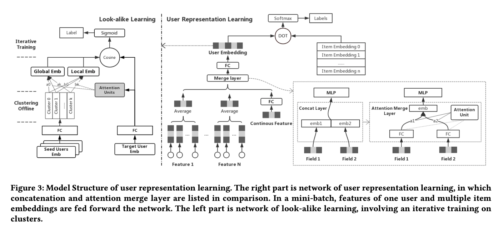
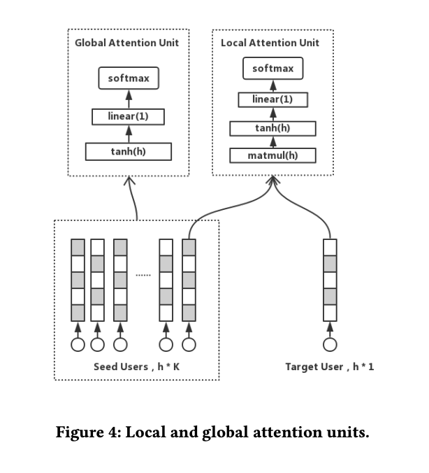

# Real-time Attention Based Look-alike Model for Recommender System

# 标题
- 参考论文：Real-time Attention Based Look-alike Model for Recommender System
- 公司：WeiXin Tencent
- 链接：https://arxiv.org/pdf/1906.05022
- Code：
- 时间：2019
- `泛读`

## 摘要

- 问题：
  - 深度学习模型在推荐系统中表现越来越好，但 **"马太效应"** 越来越明显，头部内容越来越火，大量优质长尾内容（人工推送、新颖性内容、最新新闻）由于**缺少行为特征**，无法及时获得曝光，伤害了推荐的质量和多样性
  - 传统的 look-alike 模型在在线广告中广泛使用，但**不适合推荐系统**，因为推荐系统对实时性 (real-time) 和有效性 (effectiveness) 都有严格要求
- 方法：
  - 提出 RALM (Real-time Attention Based Look-alike Model)，一个**基于相似度的实时 look-alike 模型**，主要解决实时性和有效性之间的冲突
  - **User Representation Learning**：提出 attention merge layer 替代 concatenation layer，显著提升多 field 特征学习的表达能力
    - 解决传统 concat 层在多 field 特征下出现的，强相关特征过拟合 + 弱相关特征欠拟合的问题
  - **Look-alike Learning**：考虑到 seeds 用户成员的多样性，设计 global attention unit 和 local attention unit 分别学习鲁棒和自适应的 seeds 表征
    - global attention：学习对 seeds 群体本身的全局表征，惩罚噪声用户
    - local attention：根据特定 target user 学习 seeds 的局部表征，提升自适应性
  - **Seeds Clustering**：引入 K-means 聚类机制，既降低 attention units 在线预测的时间复杂度，又最小化 seeds 信息的损失
- 部署效果：
  - 已落地在微信"看一看 / Top Stories"推荐系统
  - 据称是**业界第一个应用在推荐系统中的实时 look-alike 模型**
> **本质上就是把广告里的 look-alike 思路（找相似用户）搬到推荐系统里给长尾内容做 audience extension（受众扩展），但通过双塔 + attention + 聚类三个工程设计同时解决了"实时"和"准确"的矛盾**


## 1 Introduction

### 1.1 问题背景：推荐系统的马太效应
- 现状：
  - DNN/RNN 等深度学习模型在推荐任务上表现优异，能有效捕捉用户偏好、item 特征、以及用户-item 之间的非线性关系
  - 但这些 end-to-end 模型本质上**追求 CTR 最大化**，会倾向于给头部内容打高分
- 问题：长尾内容（manual pushing 推送、新颖内容、最新新闻）**严重缺失行为特征**
  - 行为特征是 CTR 模型的核心输入，没有它就无法预估
  - 结果：长尾内容拿不到曝光 → 没有点击 → 永远没行为特征 → **死循环（马太效应）**
- 危害：推荐质量下降 + 多样性变差，已成为业界共性难题

### 1.2 推荐系统中 audience extension 的三个量化要求
不同于广告，推荐对 look-alike 有三条**互相冲突**的硬指标：

| 维度              | 要求                                               | 难点                     |
|-----------------|--------------------------------------------------|------------------------|
| **Real-time**   | 新内容（新闻/人工推送）必须秒级/分钟级生效                           | 不能 per-candidate 离线训模型 |
| **Effective**   | 作为 CTR 模型的补充，不能掉精度，且要保证用户兴趣表征 + seeds 表征的准确性和多样性 | 简单相似度方法精度不够            |
| **Performance** | 上万 candidate × 百万级 seeds，全部要在线打分                 | 模型不能太复杂                |

> **本质上是个"不可能三角"**：传统 LR look-alike 牺牲 real-time；纯 cosine 相似度牺牲 effective；Yahoo 混合方案三个都想要但还是要几小时预处理，real-time 没真正解决。

### 1.3 已有方案的不足
- **Regression-based（如 LR）**：对每个 candidate 离线训一个模型 → 精度好但**无法实时**
- **Similarity-based（如 cosine 平均）**：实时性好但**精度远差于回归方法**
- **Yahoo Hybrid Model (2016)**：u2u 相似度图 + 回归过滤的两步法 → 平衡了精度和性能，但**仍需几小时准备 candidate 的特征权重**，不算真正实时

### 1.4 实时 look-alike 的两个核心难点
实时 look-alike 必然走"基于 seeds-to-user 相似度计算"的路线，但准确率会因为 user 和 seeds 表征不好而受损：

#### 难点 1：User Representation（用户表征）
- 为了多样性，需要喂入**多 field** 用户特征（兴趣 tag、购物兴趣、社交关系、订阅、登录 app...）
- **反直觉发现**：DNN 喂入弱相关特征反而效果**变差**
  - **强相关特征（如兴趣 tag）**：主导梯度 → 过拟合
  - **弱相关特征（如购物兴趣）**：梯度太弱 → 几乎学不动 → 变成噪声
- **本质上就是 concat 层强迫所有 field 共享同一套权重分布，强特征压住了弱特征，这一点在我们的工作中其实明显观察到**

> **【跨 paper 连接】"特征过载导致 DNN 退化" 是普遍现象**
>
> 这个"加弱相关特征反而变差"的发现并非 RALM 独有，在多个推荐系统 paper 中都能观察到类似问题，可以归纳为同一类问题的不同表现：
>
> | 场景                            | 现象                        | 根因                          |
> |-------------------------------|---------------------------|-----------------------------|
> | **DCN-V2**：所有特征过 cross net    | 强特征主导交叉、弱特征被淹没            | cross 操作对特征对一视同仁，无 routing  |
> | **DCN-V2**：增加专家数 / 提高矩阵秩      | 收益递减                      | 朴素门控不能利用额外容量                |
> | **RALM**：concat 多 field 喂 DNN | 强 field 过拟合 + 弱 field 欠拟合 | concat 强迫所有用户共享同一套 field 权重 |
> | **PEPNet / MMoE**             | 不同任务/域需要不同特征权重            | 单一网络无法同时拟合多分布               |
>
> **共同根因可抽象为**：
>
> > **当输入特征/容量异构，但模型对它们用统一的处理方式时，强信号会主导优化、弱信号会被淹没。**
>
> **业界两条主流解决路径**：
>
> 1. **学习特征级权重（attention 路线）**：RALM attention merge / AutoInt self-attention / FiBiNET SENET / DIN attention
>    - 思路：**所有特征过同一套网络，用 attention 调权重**
>    - 优点：轻量
> 2. **拆分网络容量（MoE / Gate 路线）**：DCN-V2 MoE / PEPNet Gate-NU / MMoE / 各类 Gated Fusion
>    - 思路：**不同特征/样本走不同网络分支**
>    - 优点：精细，但更重
>
> RALM 选了路径 1（attention 路线，轻量），更适合实时打分场景。在工业实践中，这两条路径常常**组合使用**（如 PEPNet 同时有 attention 和 gate）。

#### 难点 2：Seeds Representation（种子用户群体表征）
- Seeds 数量大（百万级）、构成复杂、含噪声用户
- 两个子要求：
  - **Robustness（鲁棒性）**：每个 seed 应有不同贡献，不能等权处理 → 需要**惩罚噪声用户**
  - **Adaptivity（自适应性）**：target user 可能只与 seeds 中**一小部分**相似 → 需要**针对不同 target 给出不同的 seeds 表征**

### 1.5 RALM 的三大贡献
#### 贡献 1：Attention Merge Layer（提升 user representation）
- 用 attention merge layer **替代** concatenation layer
- 核心思想：让模型对**不同 field 学习个性化权重**，而不是所有用户共享一套权重
- 解决了多 field 特征下的过拟合 + 欠拟合双重问题

#### 贡献 2：Global + Local Attention（提升 seeds representation）
- **Global Attention Unit**：对 seeds 群体本身做 self-attention，加权代表性用户、惩罚噪声用户 → 鲁棒
- **Local Attention Unit**：以 target user 为 query，对 seeds 做 attention → 自适应，每个 target 对应一份不同的 seeds 表征
- 两者互补：global 抓"这群 seeds 整体长啥样"，local 抓"这群 seeds 里哪些和当前 target 像"

#### 贡献 3：实时 + 高性能的工程实现
- **K-means 聚类**：把百万级 seeds 聚成 k 个 cluster（k=20），attention 只在 cluster 中心上算 → 复杂度从 `O(n·h²)` 降到 `O(k·h²)`
- **迭代训练**：聚类结果会随 user embedding 更新而变化，因此聚类和模型训练**交替迭代**
- **在线异步**：seeds 实时收集 + 5 分钟一次重聚类 + 在线只算 attention → 新 candidate 只要有种子点击就**立即生效，无需重训**

### 1.6 RALM 在 paper 谱系中的位置
和笔记里的 DIN/DMR 对比，attention 应用对象完全不同：

|                         | DIN / DMR              | RALM                 |
|-------------------------|------------------------|----------------------|
| attention 输入            | 单用户的历史行为序列             | 一群种子用户               |
| 序列长度                    | 几十到几百                  | 几百万（聚类后到 k=20）       |
| 噪声来源                    | 偶然点击                   | 噪声用户、跟风用户            |
| local attention 的 query | target item            | target user          |
| local attention 目的      | 找与 target item 相关的历史行为 | 找与 target user 相关的种子 |

> **本质上是把"DIN attention 在用户行为序列上做加权"的思路迁移到了"用户群体上做加权"，公式形式几乎一样，但应用场景从 single-user modeling 升级到 group modeling**
---
> **Section 1 一句话总结**：推荐系统因马太效应导致长尾内容曝光困难 → look-alike 是好工具但传统方法做不到实时 → RALM 通过 attention merge layer + global/local attention + seeds 聚类 + 异步更新，第一次同时实现了 real-time、effective、performant 的 look-alike。


## 3 Related Work

> 作者把已有工作分成两块讨论：**user representation** 和 **look-alike algorithm**，每一块的论述都在为后面对比自己方法做铺垫。这是工业界论文的典型写法，**related work 即"挖坑给自己跳"**。

### 3.1 User Representation 的三个层次

| 层次        | 方法                                                   | 问题                               |
|-----------|------------------------------------------------------|----------------------------------|
| **特征工程级** | 直接用 categorical feature vector `f = (f_1, ..., f_n)` | 维度爆炸（百万级）+ 稀疏，**无学习**            |
| **降维级**   | LSH / K-means hash 分配 cluster                        | 直接在原始特征上算，**仍无学习过程**，表征粗糙        |
| **学习级**   | YouTube DNN 等深度模型学 embedding                         | 能学到高阶交互，但 concat 层有强弱特征过拟合/欠拟合问题 |

**作者的论证链**：前两类都是无学习的 → 第三类有学习但 concat 层不够好 → 我用 **attention merge layer** 解决。

> **本质上就是用"是否有学习 + 是否处理多 field"两个维度做切分，最后给自己留出唯一的位置。**

### 3.2 Look-alike 算法的二分法（经典分类，值得记住）

| 类别                   | 代表方法                                  | 工作方式                                    | 优劣                            |
|----------------------|---------------------------------------|-----------------------------------------|-------------------------------|
| **Similarity-based** | Cosine / Jaccard / Dot product + 平均池化 | seeds embedding 平均 → 算和 target 相似度      | **快但糙**：少数派信息（虽少但更相似）被多数派淹没   |
| **Regression-based** | LR / FM / MLP**（per candidate）**      | seeds 当正样本，随机用户当负样本，每个 candidate 训一个分类器 | **准但慢**：新 candidate 必须重训，无法实时 |

#### Yahoo Hybrid Model (2016) 的特殊批评
- 方法：第一步用户聚类 + 第二步 LR 类回归过滤
- 表面看：似乎兼顾了精度和性能
- **作者的批评点**：本质还是需要**离线准备每个 candidate 的特征权重**，需要数小时才能让新 candidate 生效 → 不是真正的 real-time
- > **本质上是"假 real-time"**：seeds 实时变了，但 candidate-level 的权重没跟着变

> **这个二分法很有迁移价值**：以后看任何 retrieval / matching paper 都可以套这个框架——是基于"距离/相似度"的还是基于"分类器"的？

### 3.3 Attention 机制的发展史（为 Section 5 埋伏笔）

作者特意梳理了 attention 的演进，是为了给后面的设计找历史依据：

| 年份   | 工作                                   | 贡献                             | RALM 中的对应                                  |
|------|--------------------------------------|--------------------------------|--------------------------------------------|
| 2014 | Bahdanau NMT                         | 一般 attention（context-aware 加权） | **Local Attention**（target user 当 context） |
| 2017 | Lin et al. structured self-attention | Self-attention 对自身加权           | **Global Attention**（seeds 自身加权）           |
| 2017 | Vaswani Transformer                  | Attention is all you need      | 通用底座                                       |
| 2018 | DIN (Zhou et al., KDD)               | Attention 用于推荐，提取多样兴趣          | **思路启发**（attention 用在推荐是 OK 的）             |

### 3.4 RALM 的定位

经过上面的梳理，RALM 在文献谱系里的位置非常清晰：

```
User Representation 维度：
  无学习 → 浅学习 (LSH/K-means) → 深学习 concat (YouTube DNN) → 深学习 + attention merge (RALM) ⭐

Look-alike 算法维度：
  Similarity-based (实时但糙) ┐
                              ├─ Yahoo Hybrid (半实时半准) → RALM (真·实时 + 准) ⭐
  Regression-based (准但慢)   ┘
```

> **本质上 RALM 站在了两个维度的交集最优点上**：user representation 用最深的方法（attention merge），look-alike 用最实时的范式（similarity-based）但通过 attention 把精度补回来。

### 3.5 一个作者没说的盲点（个人补充）

Related Work 里**没有讨论 graph-based 方法**（如 GraphSAGE 类 user-user 相似度图），这其实是 look-alike 的一个重要分支。猜测作者有意省略：
- Graph 方法工程复杂度高，难做到实时
- 论证链上对 RALM 不构成威胁

但 **2019 之后这个方向涨得很猛**（PinSage / LightGCN / GraphSAGE），值得作为延伸思考方向：
- RALM 的"相似度计算"那一步 → 可替换成图上的随机游走相似度
- Seeds clustering → 可替换成 graph community detection

> **可能的延伸研究**：如果今天再做 RALM，会不会用 GNN 替换 K-means？这个问题自己在工作中已经开始展开了。

---

## Section 3 一句话总结

> 作者通过三个维度（user representation 学习层级 / look-alike 算法范式 / attention 机制谱系）把 RALM 钉在了"深学习 user representation + similarity-based look-alike + attention 强化"的独特位置上，所有现有方法都在这三个维度的某一个上有缺陷。

## 4 System

> 这一节讲 RALM 的**工程框架**，没有公式但信息密度很高。
> 核心思路：把整个 look-alike 拆成**"快慢两条路"**：
> - **慢路（offline）**：模型训练，不需要实时
> - **快路（online async + serving）**：seeds 的更新和打分，必须实时
>
> **本质上"实时 look-alike"是靠路径解耦实现的，不是靠让模型本身变快。**

整体结构：

```
4.1 Overview          ← 总览三大模块
4.2 Offline Training  ← 模型训练在哪做
4.3 Online Async      ← seeds 实时更新在哪做
4.4 Online Serving    ← 用户请求来了怎么打分
```



> **图解**：
> - **右上虚线框**：Online Asynchronous —— 监听 user clicks → seeds K-means clustering → 更新 seeds-cluster embedding 库（5 分钟一次）
> - **下方虚线框**：Offline —— 多 field 用户特征 → User Representation Learning → universal user embeddings → Look-alike Learning → look-alike user embeddings 库
> - **中间实线流程**：用户请求 → 取该用户 embedding → 遍历 candidates → 算 Local + Global similarity → CTR Serving

---

### 4.1 Overview

#### Candidate 的来源（三类长尾内容）
- 最新新闻 (latest news)
- 人工标记的优质内容 (manually-tagged high quality articles)
- 长尾兴趣内容 (long-tail interest contents)
- **共同特征**：都缺少行为特征，传统 CTR 模型打分偏低
- > **本质上 RALM 是 CTR 主推荐流的"补救通道"，不是替代品**

#### Seeds 的收集方式：被动 + 异步
- **被动**：seeds 不是预先指定的，**谁点了 candidate 谁就自动成为 seed**
  - 区别于广告：广告里 seeds 是广告主主动上传的种子列表
  - 推荐里 seeds 是**用户行为产生的**
- **异步**：不是每次点击就立刻处理，而是异步收集 + 5 分钟批量聚类
- > **精妙之处**：seeds 实际上是 candidate 的"动态画像"——
> - 发文 10 分钟：1000 个种子（粗糙）
> - 1 小时：1 万个种子（细化）
> - 1 天：100 万个种子（精确）
>
> **随时间精化，相似用户扩展能力越来越强，相当于内容的"自我繁殖"**

#### 系统的两个核心数据库

| 数据库                           | 内容                                      | 更新频率       |
|-------------------------------|-----------------------------------------|------------|
| **User Embedding 库**          | 全网用户的 universal embedding（offline 训练产出） | 离线天级更新     |
| **Seeds-Cluster Embedding 库** | 每个 candidate 的 k 个 cluster 中心 embedding | **5 分钟一次** |

> ⭐ **关键设计**：seeds 库**存的不是原始 seeds，而是聚类中心**。
> K-means 聚类在系统层面的核心价值是：**把"百万级 seeds"压缩成"k 个 cluster centroid"**，存储和查询都极轻量。

#### 在线打分的 dataflow

```
用户请求 → 取该用户的 user embedding (1 个)
        → 遍历所有 candidate
            → 取该 candidate 的 k 个 cluster centroid
            → 算 global similarity + local similarity
            → 输出 look-alike score
        → 排序返回
```

> ⭐ **这是整篇 paper 工程上最关键的优化**：
> 在线打分**不算用户和"具体 seeds"的相似度，只算用户和"cluster centroid"的相似度**。
>
> 单次 candidate 的 attention 计算从 `O(n × h²)` 降到 `O(k × h²)`：
> - n = 百万级（seeds 总数）
> - k = 20（cluster 数）
> - **相当于压缩 50000 倍**
>
> 这是它能做到"在线毫秒级 + 上万 candidate"的根本原因。

#### 三大模块的边界

```
                     RALM 系统
                         │
        ┌────────────────┼────────────────┐
        ↓                ↓                ↓
  4.2 Offline      4.3 Online Async   4.4 Online Serving
   Training         Processing
        │                │                │
   两阶段训练      seeds 收集 + 聚类   user 取 embedding
   (天级)           (5 分钟)           candidate 打分
                                       (毫秒级)
        │                │                │
   产出：模型权重    产出：cluster      产出：look-alike
   + user emb 库    centroid 库        score
```

#### ⚠️ 一个不对称设计：为什么 user emb 不也实时更新？

- User embedding 是**离线天级**产出，但 seeds 是**5 分钟级**的
- 看似不对称，实际是**有意的工程权衡**：
  - User embedding 训练涉及全网亿级用户 + 多 field 特征 + DNN 反向传播，**计算量大**
  - 用户长期兴趣变化慢，**天级更新够用**
  - 真正需要实时的是**新 candidate 上线**这件事
- > **本质上是把"实时性预算"花在最需要的地方**——seeds 是轻的，让它跑实时；user embedding 是重的，让它走离线。
>
> **这种"轻重分离"的思路在工业系统里非常普遍**，可以记下来。

---

### 4.1 一句话总结

> RALM 的实时性来自**架构解耦**而非**模型加速**：把"模型训练（重）"放离线天级跑，把"seeds 更新（轻）"放在线 5 分钟跑，把"打分计算（极轻）"放在线毫秒级跑。每一层用相称的计算预算解决相称的问题。


### 4.2 Offline Training

> 整个 RALM 离线训练分两个 phase，**这是论文的灵魂设计**——
> Phase 1 用海量数据学通用表征，Phase 2 在通用表征上学任务特定模型。

#### Phase 1: User Representation Learning

| 项        | 内容                                             |
|----------|------------------------------------------------|
| **输入**   | 全部 field 的用户特征（兴趣 tag、购物兴趣、登录 app、社交关系等）       |
| **训练样本** | 用户在微信里的**所有类型行为**：读文章、看视频、买东西、听音乐、订阅、登录 app... |
| **输出**   | **universal user embedding**（通用用户表征）           |
| **作用**   | 作为下游 Phase 2 的输入，并存入 user embedding 库供在线打分使用   |

> **关键**：这一阶段**不针对任何特定 campaign**，目标是学到一个尽可能通用、覆盖多种行为信号的 user 表征。

#### Phase 2: Look-alike Learning

| 项        | 内容                                                                              |
|----------|---------------------------------------------------------------------------------|
| **输入**   | Phase 1 产出的 universal user embedding                                            |
| **训练样本** | **audience extension campaign 样本**（具体是 `{uid, item_id, is_click}`，详见 Section 6） |
| **输出 1** | **look-alike user embedding**（存入数据库，在线打分时 fetch）                                |
| **输出 2** | **global / local attention 模型权重**（留在线上服务进程，实时预测 seeds embedding）                |

> **本质上 Phase 2 学的是"群体相似 → 行为相似"的映射**：
> 给定 target user 和一组 seeds（candidate 的点击者），预测 target user 会不会也点击。
> 把"是否相似"和"是否会点击"这两件事 ground 在真实数据上。

#### ⭐ 为什么训练要分两阶段（论文没明说但很关键）

**单阶段端到端方案的问题**：
- audience extension 样本量**远小于**全行为样本量
- 在小样本上端到端训 → user representation 学不充分，**过拟合到当前 campaign**
- 换个 campaign 要重训整个网络

**两阶段方案的优势**：
- Phase 1 用海量数据 → user embedding **泛化性强**
- Phase 2 在通用 representation 上学轻量映射 → **样本需求低**
- 换 campaign **只需重训 Phase 2，Phase 1 复用**

> **本质上这是"基础模型 + 下游任务"的范式**——
> 和 NLP 里 BERT pretrain + downstream finetune 完全同构。
> 2019 年这个范式在推荐领域还没普及，所以论文没提这个类比，但这正是 RALM 的精髓。

#### Phase 2 双输出设计的细节

为什么 user embedding 可以预存，而 seeds embedding 必须在线算？

| 输出                        | 存储方式       | 原因                                                       |
|---------------------------|------------|----------------------------------------------------------|
| look-alike user embedding | **预存到数据库** | 与 target user 无关，可批量产出                                   |
| attention 模型权重 + 在线推理     | **留在服务进程** | local seeds embedding **依赖 target user**，target 来了之前算不出来 |

> **本质上是"能离线就离线、必须在线才在线"的最大化解耦**——
> 这是工业系统设计的通用原则。

#### 训练流程小结

```
Phase 1: User Representation Learning (离线，重)
    全网用户多 field 特征
        ↓ DNN + attention merge layer
    universal user embedding ─────┐
        │                         │
        ↓ 存入数据库              ↓ 作为输入
    [User Embedding 库]      Phase 2: Look-alike Learning (离线，相对轻)
                                  audience extension 样本
                                      ↓ 双塔 + attention units
                              ┌───────┴───────┐
                              ↓               ↓
                    look-alike user        global/local
                       embedding           attention 权重
                              │               │
                              ↓               ↓
                  [Look-alike Emb 库]    [部署到在线服务]
```

#### 延伸思考：和 2024+ LLM 推荐的对比

如果今天再做 RALM，可能的现代化方案：
- 用 **LLM** 做 user representation（替代 Phase 1 的 DNN）
- seeds 描述成自然语言 prompt
- 用 LLM in-context learning 直接出相似度

但 2019 年没有这个选项，RALM 用 "DNN + attention" 的组合达成了同样的"通用表征 + 任务适配"效果。

> **RALM 真正的贡献**：是这种**"先通用后专用"的范式**，不是 attention merge 或 global/local attention 本身。
> 这两个具体的 attention 设计都是为这个范式服务的。


### 4.3 Online Asynchronous Processing

> 这一节是 RALM **实时性的真正源头**。
> 4.2 offline 是"重但慢"，4.4 serving 是"轻但被动"，**只有 4.3 是主动跑且必须实时的**。

#### 模块拆分

```
4.3 Online Async
    ├── User feedback monitor  (监听点击 → 更新 seeds 列表)
    └── Seeds clustering       (5 分钟跑一次 K-means)
```

---

#### 组件 1：User Feedback Monitor

- 做的事：监听全网用户的点击日志，**谁点了哪个 candidate，就把这个 user 加进对应 candidate 的 seeds 列表**

- **关键截断设计**：每个 candidate **只保留最新 300 万 seeds**
  - 理由 1（性能）：K-means 复杂度 `O(n × k × iter)`，n 太大跑不动
  - 理由 2（时效性）：老 seeds 的兴趣已漂移，可能反而是噪声
  - > **本质上隐含一个判断：seeds 的"新鲜度" > "代表性"**

- **滑动窗口逻辑**：超过 3M 后，最老的 seed 被踢出
  - 长青内容 → seeds 持续轮换（合理：真实受众也在变）
  - 短期热点内容 → seeds 完整保留

#### 组件 2：Seeds Clustering

- **核心逻辑**：每 5 分钟跑一次 K-means，把 seeds 聚成 k 个 cluster，存 cluster centroid

- **公式 (1)** —— Seeds 的 raw representation：
```
R_seeds = { E_centroid_1, E_centroid_2, ..., E_centroid_k }
```

- > ⭐ **这个公式看似平淡但极其关键**：
> R_seeds **替代了原始 seeds**——百万级 seeds 被压缩成 k 个向量。
> 在线打分时所有 attention 计算都在 R_seeds 上做，**不再触及原始 seeds**。
> 这就是为什么 RALM 能做到"百万 seeds → 毫秒打分"。

- > **概念升维**：在 RALM 的视角里，**"seeds 的真实身份"不是 100 万个用户向量，而是 20 个 cluster centroid**。
> 作者用 "raw representation" 这个词暗示：cluster centroids 才是"原始/未加工的 seeds 表征"。

#### 5 分钟周期的工程取舍

| 频率           | 问题                            |
|--------------|-------------------------------|
| 太频繁（< 1 分钟）  | K-means 计算开销过大，集群压力大          |
| 太稀疏（> 30 分钟） | 新 candidate 等聚类延迟太大，"实时" 体感丢失 |
| **5 分钟**     | **刚好够实时 + 计算可承受的临界点**         |

> **5 分钟是工业 near-realtime pipeline 里的经验值**，很多公司的离线-在线衔接都在这个量级。

#### "Append-fast, Recompute-batch" 模式

> seeds 的**加入**是流式的（即时），但 cluster 的**更新**是批式的（5 分钟）。
>
> ```
> 用户点击 → 立即追加到 seeds 列表 (流式，无延迟)
>                    ↓
>              每 5 分钟批量重聚类 → 更新 R_seeds (批式)
> ```
>
> 这是个工业系统通用模式：**既保证数据新鲜，又控制重计算成本**。

#### 为什么用 K-means 而不是其他聚类（论文没明说）

- **k 固定**：在线服务需要固定输出维度，方便存储/计算
- **快**：`O(nkd)`，比层次聚类、DBSCAN 都快
- **可增量**：mini-batch K-means 支持流式更新（虽然 RALM 用的是周期性全量重跑）

DBSCAN / HDBSCAN 的 cluster 数不固定 → 不适合"固定 k 个 centroid 上线"的场景。

#### ⚠️ 易混淆点：在线 5 分钟聚类 vs 离线迭代聚类

读到 5.3 时会看到一个"iterative training"——别和这里的 5 分钟聚类混淆，**完全是两件事**：

| 维度                | 在线 5 分钟聚类（4.3）  | 离线迭代聚类（5.3）        |
|-------------------|-----------------|--------------------|
| 触发条件              | 时间 + 新 seeds 进来 | 每个训练 epoch 结束      |
| 用的 user embedding | **当前线上版本**（不变）  | **训练中的版本**（每轮变化）   |
| 目的                | 保持 seeds 表征新鲜   | 保持聚类和 embedding 同步 |
| 时间尺度              | 分钟级             | 小时级（一个 epoch）      |

#### 4.3 一句话总结

> 用"流式 append + 批式 recompute"的双速结构，配合 K-means 把百万 seeds 压成 20 个 centroid，
> RALM 既保证了 seeds 的新鲜度，又把在线 attention 计算量压到了可接受范围。
> **这是整个系统"实时性"的工程支点。**


### 4.4 Online Serving

> 这一节短但关键——所有 4.1/4.2/4.3 的铺垫都是为了让这一节的打分公式能跑得动。

#### 在线打分的 dataflow

```
用户请求来了
    ↓
[Step 1] 取该用户的 look-alike user embedding (1 个向量, h 维)
    ↓
[Step 2] 遍历所有 candidate (上万个)
    │
    ├─ 取该 candidate 的 k 个 cluster centroid (来自 4.3 的 R_seeds)
    │
    ├─ 喂入 Global Attention Unit → E_global_s (1 个向量)
    │
    ├─ 喂入 Local Attention Unit (target user 当 query) → E_local_s
    │
    └─ 算 cosine 相似度 → 加权求和 → 这个 candidate 的 look-alike score
    ↓
[Step 3] 所有 candidate 的 look-alike score 进 CTR 流水线
```

> 提前说明（详见 5.3）：
> - **E_global_s**：seeds **自身** self-attention 池化（"这群 seeds 整体长啥样"）
> - **E_local_s**：seeds 用 target user 做 query 做 attention 池化（"这群 seeds 里和当前 user 像的部分"）

---

#### 公式 (2)：Look-alike Score

```
score_{u,s} = α · cosine(E_u, E_global_s) + β · cosine(E_u, E_local_s)
```

| 符号           | 含义                                                      |
|--------------|---------------------------------------------------------|
| `E_u`        | target user 的 look-alike embedding                      |
| `E_global_s` | seeds 的 global representation（self-attention 池化）        |
| `E_local_s`  | seeds 的 local representation（target-aware attention 池化） |
| `α, β`       | 加权系数，**论文取 α=0.3, β=0.7**                               |

#### 设计选择 1：为什么用 cosine 而不是 dot product？

- cosine 比 dot product 多一层 **归一化**
- 不同 candidate 的 seeds 集合大小不同 → E_global/local 模长不同
- **归一化后，不同 candidate 之间的 score 可比性更强**
- > **本质上是为多 candidate 排序服务**：raw similarity 量级差太大会让排序失真

#### 设计选择 2：为什么是加权和而不是其他融合方式？

| 融合方式          | 优劣                     |
|---------------|------------------------|
| **加权和**（论文方案） | 简单稳定，α/β 可基于业务直接调，不需重训 |
| 乘积            | 放大噪声，不稳定               |
| max           | 丢失另一边信息                |
| attention 融合  | 又要训一组参数，复杂度上升          |

#### ⭐ α=0.3, β=0.7 这个比例的深层含义

| 维度 | Global (α=0.3)     | Local (β=0.7)                |
|----|--------------------|------------------------------|
| 含义 | 这群 seeds 整体长啥样     | 这群 seeds 里和当前 user 像的部分      |
| 作用 | candidate 的"基础匹配度" | candidate 对当前 user 的"个性化匹配度" |

> **β > α 隐含的判断：作者认为"个性化匹配"比"整体匹配"更重要**。
>
> **业务直觉**：
> - 一篇技术文章的 seeds 里有 100 万人，整体是"关注科技+互联网"的人
> - 但具体某个 target user 可能只对其中"特别关注 AI"的 10 万 seeds 真正相关
> - **应该按"AI 子群体"的相似度打分，而不是"整个科技人群"的整体相似度**
>
> **本质上 β > α 是承认"群体内部有结构、不同 user 应匹配不同子群体"**——
> 这正是 local attention 存在的意义。如果 α=β，local 的边际价值就被稀释了。
>
> **工程经验带回**：在自家系统做类似的"全局+局部"融合时，**local 至少占 60%+** 是个合理起点。

---

#### Look-alike Score 的最终用法（容易漏掉的关键点）

论文原文：
> "The look-alike model score will be taken as weighting factor in CTR prediction work-flow."

这句话点出了 RALM 的最终定位：**look-alike score 不是替代 CTR 预估，而是 CTR 流水线里的"加权因子"**。

实际用法（论文未明说，但典型形式）：

```
final_score = CTR_score × (1 + γ · look_alike_score)
                              └─────┬──────┘
                              对长尾内容的"加成"
```

- 长尾内容 CTR_score 普遍偏低
- 但 look-alike score 高 → 给一个加成
- **在排序中冒出来的机会**，打破"低 CTR → 不曝光 → 永远低 CTR"的死循环

> **本质上回答了 Section 1 的核心问题**：怎么"补救"长尾曝光？
> RALM 没改 CTR 模型本身，而是**作为旁路给 CTR 打补丁**——很轻、很工业。

---

#### 在线打分的"轻"在哪里：复杂度账

| 步骤                                       | 复杂度           |
|------------------------------------------|---------------|
| 取 user embedding                         | O(1)          |
| 取 k 个 cluster centroid                   | O(k)          |
| Global attention（self-attention on k 向量） | O(k² × h)     |
| Local attention（k 向量 vs 1 query）         | O(k × h)      |
| Cosine 相似度（2 次）                          | O(h)          |
| **单 candidate 总计**                       | **O(k² × h)** |

代入实际值：k=20, h=128
- 单 candidate ≈ 51,200 次乘法 → GPU 上几微秒
- 10,000 candidates ≈ 5 × 10⁸ 次乘法 → 毫秒级完成

**对比：如果不聚类直接对 100 万 seeds 算 attention**：
- 单 candidate: `O(n × h) = 1M × 128 = 1.28 × 10⁸`
- 10000 candidates: `1.28 × 10¹²`，**比聚类版慢 2500 倍**

> ⭐ **K-means 聚类不是为了精度（Section 6.6 显示 k=100 略优于 k=20），而是为了让在线计算变得可行**。
> 这是经典的"精度换性能"工程权衡。

---

#### 4.4 一句话总结

> 在线打分用 cosine + 加权和把 user/global/local 三个向量收敛成一个 score，
> 然后作为 weighting factor 注入 CTR 流水线给长尾内容加成。
> **整个流程的轻量化**完全建立在 4.3 的"k 个 centroid 替代百万 seeds"之上——
> 没有 4.3 的聚类，4.4 的实时打分根本不可能。

---

## Section 4 整体回顾

至此 Section 4 完整读完，整个工程框架可以总结为：

```
┌─────────────────────────────────────────────────────────────┐
│                       RALM 系统                              │
├─────────────────────────────────────────────────────────────┤
│                                                              │
│  4.2 Offline (重，慢)                                        │
│  ─────────────                                               │
│  Phase 1: User Representation Learning                       │
│      → universal user embedding (天级)                       │
│  Phase 2: Look-alike Learning                                │
│      → look-alike user embedding (存库)                      │
│      → attention 模型权重 (部署在线)                          │
│                                                              │
│  4.3 Online Async (流式 append + 批式 recompute, 5 min)      │
│  ────────────────────────────────────────────                │
│  User Feedback Monitor → seeds 列表 (保留最新 3M)            │
│  Seeds Clustering → R_seeds = {centroid_1, ..., centroid_k}  │
│                                                              │
│  4.4 Online Serving (轻量, 毫秒级)                           │
│  ──────────────────                                          │
│  score = α·cos(E_u, E_global) + β·cos(E_u, E_local)         │
│  作为 weighting factor 注入 CTR 流水线                       │
│                                                              │
└─────────────────────────────────────────────────────────────┘
```

> **整篇 Section 4 的核心思想一句话：**
> RALM 通过"重的离线 + 中的异步 + 轻的在线"三层解耦，
> 让"实时 + 准确 + 高性能"这个不可能三角变成了可能。


## 5 Model

> 本节讲三件事：**user representation 学习、seeds representation 学习、look-alike similarity 建模**。
> 公式密集，是论文最核心的部分。

### 5.1 Features

#### 特征类型分类

| 类型                  | 子类                  | 例子                                      |
|---------------------|---------------------|-----------------------------------------|
| **Categorical**（离散） | **Univalent**（单值）   | gender、location                         |
|                     | **Multivalent**（多值） | interested keywords、subscribed accounts |
| **Continuous**（连续）  | -                   | age                                     |

#### 关键术语：Feature Field

> "For a value or a set of value representing one kind of categorical features, we call it a feature field."

**一个 field = 一类特征**。比如：
- "interested tags" 是一个 field（即使一个用户有多个 tag，都属于同一个 field）
- "shopping interests" 是另一个 field
- "logged-in apps" 是另一个 field

> ⭐ **这个术语很关键**：后面 attention merge layer 整个设计都是围绕"feature field"展开的——
> attention 学的是**field 之间的权重**（不是 field 内部的权重）。

#### 微信场景特征列表（异质性强）

- 用户画像：gender、age、location
- 兴趣类：interested tags、interested categories
- 行为类：apps logged in、media ids、accounts subscribed
- 跨域兴趣：shopping interests、search interests
- 社交：social network relations

> **这些特征异质性极强**——
> - 强相关（如 interested tags）：直接反映兴趣
> - 弱相关（如 shopping interests）：跨域信号，间接反映兴趣
>
> **5.2 的 attention merge layer 就是为了解决"强弱混合"导致的 concat 失败问题。**

#### 连续特征处理

- 归一化到 `[0, 1]` 区间
- 标准操作，无特殊设计


### 5.2 User Representation Learning



整节分三块：
1. **Sampling**：训练样本采样（公式 3/4）
2. **Model structure**：基础网络结构（公式 5）
3. **Attention merge layer**：核心创新（公式 6/7/8）⭐

---

#### 5.2.1 Sampling

##### 任务建模：多分类问题

- 任务定义：给定一个用户，从全部 item 池子里"选出他感兴趣的那一个"
- 这就是 **YouTube DNN (2016) 的经典套路**：**用"用户行为预测"作为代理任务**
- 目标不是预测准确，而是**把用户表征学好**——最后一层 user embedding 就是产物

##### 为什么用 negative sampling

- 百万级 item → 全量 softmax 计算量爆炸
- 借鉴 word2vec 的 NCE-like loss

##### 直接随机采样的问题

- 真实 item 分布是**长尾**的
- 随机采样得到的负样本分布是**均匀**的
- 结果：模型对**冷门 item 的负信号过强、热门 item 的负信号过弱**

##### 公式 (3)：基于排名的负采样概率

```
p(x_i) = (log(k+2) - log(k+1)) / log(D+1)
```

| 符号       | 含义                                     |
|----------|----------------------------------------|
| `x_i`    | 第 i 个 item                             |
| `k`      | 第 i 个 item **按出现频率的排名**（k 小=热门，k 大=冷门） |
| `D`      | item 总数                                |
| `p(x_i)` | 被选作负样本的概率                              |

**关键性质**：`log(k+2) - log(k+1)` 随 k 增大**单调递减**：
- k=1（最热门）：≈ 0.405
- k=100：≈ 0.0099
- k=1000：≈ 0.001

| 排名            | 采样概率   | 直觉                         |
|---------------|--------|----------------------------|
| **越热门 (k 小)** | **越大** | 真实曝光多，"没点"是强负信号 → 应多采      |
| **越冷门 (k 大)** | **越小** | 用户没点很可能只是没见过 → 不是真负样本 → 少采 |

> **本质上这个采样概率拟合的是 item 的真实曝光分布**——
> 给越多人见过的 item 越多负样本机会，避免冷门 item 被错误打成"用户不感兴趣"。

##### 工程细节

- 每个用户最多 **50 个正样本**：防止"超活跃用户"主导 loss
- **正负比例 1:10**

##### 公式 (4)：sampled softmax

```
P(c=i | U, X_i) = exp(x_i^T u) / Σ_{j∈X} exp(x_j^T u)
```

- `u`: 用户 embedding（DNN 输出）
- `x_j`: item embedding
- `X`: 采样后的 11 个 item（1 正 + 10 负）

> 只在采样后的 11 个 item 上做 softmax，不是百万级全量。

##### 多类型行为采样

- **explicit + implicit feedback** 都作为样本
- 行为类型多样化：article、video、website 都纳入
- > **本质上"喂给模型多样的行为信号"是为了让 user embedding 覆盖更多兴趣维度**

---

#### 5.2.2 Model Structure（基础结构）

参考 **YouTube DNN**：

```
User features (multi-field)
    ↓
[Embedding layer]  每个 field 各自 embed 成固定长度向量
    ↓
[Average pooling]  multivalent field 内多值平均
    ↓
[Concat layer]     所有 field 的 embedding 拼接 ⚠️ 论文要替换的就是这一层
    ↓
[MLP layers]       几层 FC
    ↓
User embedding u
```

##### 公式 (5)：Cross Entropy Loss

```
L = -Σ_{i∈X} y_i · log P(c=i | U, X_i)
```

- 标准 CE loss，y_i ∈ {0, 1}
- 优化器：**Adam**
- loss 收敛后，最后一层输出就是 user 表征

---

#### 5.2.3 Attention Merge Layer ⭐（核心创新）

##### 问题：concat 为什么不行

论文观察：
> "optimization is always overfitted to some certain fields, which are strongly relevant to user interest on contents, such as interested tags."

**翻译**：训练总是过拟合到强相关 field（interested tags），导致：
- 推荐结果**几乎完全由这几个强 field 决定**
- 弱相关 field（shopping interests）**几乎没起作用**
- 多样性差

**根因**：concat 强迫所有用户共享**同一套** field 权重分布
- Concat 后的 MLP 第一层权重 W 是**全用户共享**的
- 训练时强 field 来的梯度最大 → MLP 优先优化强 field 的权重
- **强 field 占满网络容量，弱 field 被挤压**

> **本质上和工作中"200 个特征只有 10 几个起作用"是同一个问题**——
> 强弱信号在共享网络里互相抢资源（参考 `dcn_expert_split_thinking.md`）。

##### 解决方案：给 field 学个性化权重

**核心思想**：不让所有用户共享 field 权重分布，而是**根据每个用户的具体 H 表征，学一个"属于他的"field 权重分布**。

##### 公式 (6)：算激活

```
u = tanh(W_1 H)
```

| 符号    | 形状      | 含义                            |
|-------|---------|-------------------------------|
| `H`   | R^(n×m) | n 个 field 的 embedding 拼成的矩阵   |
| `W_1` | R^(k×n) | 第一个权重矩阵，k 是 attention unit 大小 |
| `u`   | R^(k×m) | 激活矩阵                          |

##### 公式 (7)：算 field 权重

```
a_i = exp(W_2 u_i^T) / Σ_j exp(W_2 u_j^T)
```

| 符号    | 形状     | 含义                         |
|-------|--------|----------------------------|
| `W_2` | R^k    | 投影向量                       |
| `a_i` | scalar | 第 i 个 field 的 attention 权重 |
| `a`   | R^n    | n 个 field 权重，softmax 后和为 1 |

##### 公式 (8)：加权融合

```
M = a · H
```

- 用 attention 权重对 n 个 field 的 embedding 做加权求和
- 输出长度 m 的融合向量 M，喂给后续 MLP

---

##### 维度推导（重要！论文表述有歧义，这里用合理实现重述）

约定符号：
- `n` = field 数量（比如 n=11）
- `m` = 每个 field 的 embedding 维度（比如 m=64）
- `k` = attention unit 大小（比如 k=32）

###### 起点：H 矩阵

```
H = [ h_1 ]      shape: (n, m)
    [ h_2 ]      n 行 = n 个 field
    [ ... ]      每行 m 维 = field embedding
    [ h_n ]
```

###### 公式 (6) 维度

```
u = tanh(H · W_1^T)    其中 W_1 ∈ R^(k, m)

H · W_1^T 的形状: (n, m) · (m, k) = (n, k)
u ∈ R^(n, k)：每个 field 用 k 维向量描述其激活强度
```

> ⚠️ **论文笔误警告**：原文公式 (6) 写的是 `u = tanh(W_1 H)` 且说 `u ∈ R^n`，
> 但按形状推不通。**实际理解为 u ∈ R^(n×k)**，即每个 field 一个 k 维激活向量，才能让后续公式跑通。

###### 公式 (7) 维度

```
a_i = exp(W_2 · u_i^T) / Σ_j exp(W_2 · u_j^T)

W_2 ∈ R^k
W_2 · u_i^T = scalar (一个标量)
对 n 个 field 各算一个 scalar，softmax 归一化
→ a ∈ R^n，Σ a_i = 1
```

###### 公式 (8) 维度

```
M = a^T · H

a^T · H 的形状: (1, n) · (n, m) = (1, m)
M ∈ R^m
```

###### 完整数据流

```
n 个 field embedding
    │
    ↓ 堆叠
H ∈ R^(n, m)
    │
    ↓ 公式 (6): H @ W_1^T (W_1: k×m)
u ∈ R^(n, k)  每个 field 的 k 维激活
    │
    ↓ 公式 (7): W_2 u_i^T + softmax
a ∈ R^n  每个 field 的标量权重
    │
    ↓ 公式 (8): a · H
M ∈ R^m  加权融合后的向量
    │
    ↓ MLP
User embedding
```

###### 具体数字 walk-through

假设 `n=11, m=64, k=32`：

| Step | 操作                               | 形状变化     |
|------|----------------------------------|----------|
| 输入   | H                                | (11, 64) |
| (6)  | tanh(H · W_1^T)，W_1 ∈ R^(32, 64) | (11, 32) |
| (7)  | softmax(W_2 · u^T)，W_2 ∈ R^32    | (11,)    |
| (8)  | a^T · H                          | (64,)    |

**对比 concat**：
- Concat 输出：`R^(11×64) = R^704`
- Attention merge 输出：`R^64`
- **降维 11 倍**，同时保留了"按用户需求加权"的信息

---

##### Concat vs Attention Merge 整体对比

|      | Concat Layer       | Attention Merge Layer |
|------|--------------------|-----------------------|
| 中间表示 | 拼成长向量 (n·m 维)      | 排成矩阵 H (n×m)          |
| 融合方式 | 所有维度直接拼接，MLP 自己学   | 算 field 权重 → 加权求和     |
| 输出维度 | n·m                | **m**（降维）             |
| 个性化  | **无**：全用户共享 MLP 权重 | **有**：a 依赖 H          |

> ⭐ **关键洞察**：attention merge 的 a_i 是 H 的函数，**不同用户的 H 不同 → 不同用户的 a 不同**。
>
> **举例**：
> - 用户 Alice 的 interested tags 丰富 → a 给 interested tags 高权重
> - 用户 Bob 的 interested tags 稀疏，但 shopping interests 丰富 → a 给 shopping interests 高权重
>
> **本质上 attention merge layer 是给每个用户做了一次"特征筛选"**——
> 模型不再"一视同仁地用所有 field"，而是**学会了"按需取用"**。

##### 与 SENet (FiBiNET) 的对比

|        | RALM Attention Merge | FiBiNET SENet            |
|--------|----------------------|--------------------------|
| 权重计算依据 | 用 H 直接算 attention    | squeeze（统计量）→ excitation |
| 权重应用   | **加权求和** → 输出 m 维    | **逐 field 缩放** → 仍 n×m 维 |
| 是否降维   | **是** (n·m → m)      | **否**                    |
| 复杂度    | 略高（softmax over n）   | 略低（sigmoid per field）    |

> **最大区别**：attention merge 做了**降维 + 融合**；SENet 只做**重加权**。
> 后接 MLP 时，attention merge 的输入更小、参数更少。

##### 个人评价：这个设计的位置感

attention merge 不算革命性——field-level attention 这类工作 2018 前后很多（HAN/AFM 等），但 RALM **把它用对了地方**：

|                          | 适用场景             | 目的                |
|--------------------------|------------------|-------------------|
| HAN / AFM                | item × item 特征交叉 | **学交叉信号**         |
| **RALM Attention Merge** | user 多 field 表征  | **学 field 重要性筛选** |

> 用户兴趣分布有强弱之分，比 item 关系更需要"按需取用" → attention merge 在这个场景特别合适。

---

#### 5.2 一句话总结

> User Representation Learning 用 YouTube DNN 框架做"用户行为预测"代理任务训出 user embedding，
> 其中 sampling 用基于 item 排名的概率分布拟合真实曝光，
> 网络结构上**用 attention merge layer 替代 concat layer**，
> 通过让 field 权重个性化、避免强 field 主导训练，提升了多 field 表征的表达力。


### 5.3 Look-alike Learning ⭐

整节分六块：
1. **Model structure**：双塔架构
2. **Transforming matrix**：universal → look-alike 投影
3. **Local attention**（公式 9）⭐
4. **Global attention**（公式 10）⭐
5. **Iterative training**：聚类与模型交替更新
6. **Loss**（公式 11）



---

#### 5.3.1 Model Structure（双塔架构）

##### 输入与输出

- **输入**：Phase 1 产出的 universal user embedding（target 和 seeds 都用这套）
- **输出**：look-alike score（sigmoid 后预测点击概率）

##### 双塔结构

```
        Look-alike Score
              ↑
            Sigmoid
              ↑
          Dot Product
            ↗     ↖
   Seeds Tower    Target Tower
        ↑              ↑
   self attn +    transform
   general attn       to h
        ↑              ↑
     transform     universal
     to h          embedding
        ↑
   n × m seeds embeddings
```

| 塔                | 输入                        | 输出        | 作用    |
|------------------|---------------------------|-----------|-------|
| **Seeds Tower**  | n 个 seed user embedding   | 1 个 h 维向量 | 学群体表征 |
| **Target Tower** | 1 个 target user embedding | 1 个 h 维向量 | 学个体表征 |

> **本质上是个 user-to-group 的相似度学习问题**——
> 左塔学群体，右塔学个体，相似度 = 点击概率。

##### 双塔的设计哲学

1. **离线/在线解耦**：右塔可离线预算，左塔在线算（依赖 target）
2. **避免特征穿越**：分塔保证 seeds 不污染 target 表征
3. **Embedding 可独立缓存**：look-alike embedding 库存的就是右塔输出

---

#### 5.3.2 Transforming Matrix

##### 是什么

```
universal user embedding (m 维)
    ↓ FC layer (W ∈ R^(m×h))
    ↓ ReLU
look-alike user embedding (h 维)
```

##### 三个关键设计

**1. 从 m 维投影到 h 维**
- 工业实践通常 h ≤ m
- 相当于做了一次任务相关的特征筛选

**2. 两塔共享同一个 transforming matrix**
- 论文给的理由：防止过拟合
- **更深层的原因**：保持空间一致性
  - 不共享 → 左右塔的 h 维空间含义不同 → dot product 没意义
  - 共享 → 左右塔输出在同一语义空间 → 相似度可比

> **本质上这是"对比学习"的标准做法**——
> 衡量两个东西的相似度时，必须先把它们投影到同一空间。
> 类似 SimCLR、CLIP 里 query/key 共享 encoder 的设计。

**3. 用 ReLU 引入非线性**
- transforming matrix 本身是线性的，ReLU 让它能学非线性筛选

> **疑问**：为什么不直接用 universal embedding 不做 transform？
> 因为 Phase 1 的 universal embedding 是为"预测用户行为"训出来的，
> 它的空间不一定适合"算 user-to-group 相似度"——transform 是在做**任务对齐**。

---

#### 5.3.3 Local Attention（公式 9）⭐

##### 问题：为什么不用平均池化

> "averaging is to find the centroid of seeds, leading to a result that common information is saved whereas outliers and personalize information are [lost]."

**翻译**：平均会把"少数派但更相似"的信息淹没。

**举例**：
- candidate 是 AI 创业文章，seeds = 95 万普通科技爱好者 + 5 万 AI 创业者
- target user 是 AI 创业者
- 平均池化：代表向量被 95 万人主导 → target 和 candidate 相似度被稀释
- 应该：让那 5 万人主导匹配

> **本质上平均池化是"民主投票"，local attention 是"按相关性投票"**——
> target user 应该和"和他最像的那部分 seeds"对齐。

##### 公式 (9)

```
E_local_s = E_s · softmax(tanh(E_s^T · W_l · E_u))
```

| 符号          | 形状        | 含义                         |
|-------------|-----------|----------------------------|
| `E_s`       | R^(h × n) | seeds 的 embedding（按列堆叠）    |
| `E_u`       | R^h       | target user 的 embedding    |
| `W_l`       | R^(h × h) | local attention 矩阵         |
| `E_local_s` | R^h       | local seeds representation |

##### 维度推导

**Step 1：算 attention 分数**
```
E_s^T · W_l · E_u
形状: (n, h) · (h, h) · (h, 1) = (n, 1)
→ n 个 seed 各得一个标量分数
```

**Step 2：tanh + softmax**
```
α = softmax(tanh(分数))
α ∈ R^n，每个 seed 一个权重，softmax 归一化和为 1
```

**Step 3：加权求和**
```
E_local_s = E_s · α
形状: (h, n) · (n, 1) = (h, 1)
E_local_s ∈ R^h
```

##### 物理意义

```
For each seed_i:
    score_i = E_s_i^T · W_l · E_u   (target user 和 seed_i 的相关度)
α = softmax(tanh([score_1, ..., score_n]))
E_local_s = Σ_i α_i · E_s_i        (按相关度加权求和)
```

- W_l 学的是"如何衡量 target user 和 seed 的相关性"
- 越和 target user 相关的 seed → α 越大 → 在最终向量里占比越大
- E_local_s 是**针对当前 target user 重组的 seeds 表征**

> ⭐ **关键**：E_local_s **依赖 target user**——
> 同一组 seeds，不同 target user 来访问时得到的 E_local_s 不同。
> 这就是 "local"（局部、个性化）这个名字的来源。

##### 与 DIN 的对比

|              | DIN                              | RALM Local Attention            |
|--------------|----------------------------------|---------------------------------|
| Query        | target item                      | **target user**                 |
| Key/Value 集合 | 用户历史行为 items                     | **seeds**                       |
| 公式形式         | `MLP([h_i, q, h_i⊙q]) → softmax` | `tanh(h_i^T · W · q) → softmax` |
| 加权目的         | 找"和 target item 相关的历史行为"         | 找"和 target user 相关的 seeds"      |

> **本质上 RALM 把 DIN 的 attention 思路从"用户历史行为序列"迁移到了"群体用户集合"上**——
> bilinear（W_l）替代 MLP，**逻辑完全一致**。

##### 工程优化：聚类后再算 attention

**问题**：直接在 n 个 seed 上算复杂度 `O(n × h²)`，n 是百万级算不动。

**解法**：先 K-means 聚成 k 个 cluster centroid，在 k 个 centroid 上算 attention。

```
n 个 seeds → K-means → k 个 cluster centroids
                              ↓
                        在 k 个 centroid 上算 local attention
                              ↓
                        E_local_s ∈ R^h
```

复杂度：`O(n × h²) → O(k × h²)`，n=10⁶, k=20 → **压缩 5 万倍**

##### 工程细节

> "K-means clustering is taken before epoch starts and cluster centroids are saved in memory"

- 训练时：每个 epoch 开始前先做一次 K-means，centroid 缓存内存
- 整个 epoch 内 attention 都在这些 centroid 上算
- **不是每个 batch 重聚类**——K-means 太贵

---

#### 5.3.4 Global Attention（公式 10）⭐

##### 问题：local 已经做了加权，为什么还要 global

**Local 的局限**：
- **完全依赖 target user**——target 没出现时算不出来
- 只反映"和 target 像的 seeds"，**不反映 seeds 自身群体结构**

**举例**：
- candidate seeds = 95 万普通科技 + 5 万 AI 创业者
- target = 美食博主（和所有 seeds 都不像）→ local attention 加权也无意义
- 此时需要 global attention 给"群体整体匹配度"打分

**Global 的角色**：
- 学 seeds 群体本身的整体表征，**不依赖 target**
- 反映"这群 seeds 整体长啥样"
- 对噪声 seed 做去权重（鲁棒性）

> **本质上 local 是"个性化匹配"，global 是"整体匹配"**——
> 两者互补：
> - local 答："target 和这群 seeds 的最相关子集像不像"
> - global 答："target 和这群 seeds 的整体像不像"

##### 公式 (10)

```
E_global_s = E_s · softmax(E_s^T · tanh(W_g · E_s))
```

| 符号           | 形状                            | 含义                          |
|--------------|-------------------------------|-----------------------------|
| `E_s`        | R^(h × n)                     | seeds 的 embedding           |
| `W_g`        | R^(s × h) ⚠️ 论文写成 (s × n) 是笔误 | global attention 矩阵         |
| `E_global_s` | R^h                           | global seeds representation |

> ⚠️ **论文公式有笔误**：W_g 应该是 R^(s × h) 不是 R^(s × n)，否则维度对不上。
> **结合 Figure 4 的图示**（tanh + linear(1) + softmax），实际行为是：
>
> ```
> For each seed_i:
>     score_i = w^T · tanh(W_g · E_s_i)   ← MLP 给每个 seed 打分
> α = softmax([score_1, ..., score_n])
> E_global_s = Σ_i α_i · E_s_i
> ```
>
> 即 **self-attention 风格的池化**——seeds 互相加权自己。

##### 物理意义

- W_g 学的是"哪些 seeds 在群体中是 representative 的"
- 训练目标：让最终 score 接近真实 label
- 训练过程：
  - 噪声 seed（点击但兴趣不一致）→ α 小 → 贡献被压制
  - 代表性 seed（典型受众）→ α 大 → 贡献被放大

> ⭐ **关键**：E_global_s **不依赖 target user**——
> 同一组 seeds，无论谁来访问，E_global_s 都是同一个。
> 这就是 "global"（全局、群体）这个名字的来源。

##### Global vs Local 完整对比

| 维度           | Global Attention                   | Local Attention             |
|--------------|------------------------------------|-----------------------------|
| Attention 类型 | **self-attention**（seeds 自己加权自己）   | **target-aware attention**  |
| 输入           | seeds 集合                           | seeds 集合 + target user      |
| 输出           | 群体整体表征                             | 针对 target 的局部表征             |
| 是否依赖 target  | **否**                              | **是**                       |
| 解决的问题        | **鲁棒性**（去噪声）                       | **自适应性**（个性化）               |
| 论文借鉴         | Lin 2017 structured self-attention | Bahdanau 2014 NMT attention |

> **完美对应 Section 1.4 的两个难点**：
> - Robustness → Global Attention（去噪声）
> - Adaptivity → Local Attention（个性化）
---

#### 5.3.5 Iterative Training

##### 问题：为什么聚类需要"迭代"

```
universal user embedding (m 维)
    ↓ Transform Matrix（训练中持续更新）
look-alike user embedding (h 维)
    ↓ K-means clustering
cluster centroids (在 h 维空间)
    ↓ 用作 attention 输入
```

**问题**：训练中 Transform Matrix 持续更新 → look-alike embedding 持续变化 → **聚类结果也应该跟着变**。

如果聚类只做一次，训练几个 epoch 后 centroid 就过时了。

##### 解法：交替训练（EM 思路）

```
Repeat until convergence:
    1. 用当前 transform 矩阵算所有 seeds 的 look-alike embedding
    2. 在这批 embedding 上跑 K-means → k 个 centroid
    3. 缓存 centroid
    4. 跑一个 epoch 的训练（attention 在 centroid 上算）
    5. transform 矩阵更新，回到 1
```

频率：**每个 epoch 结束后重聚类一次**。

> **本质上这是 EM 算法的思路**——
> - **E 步**：固定 transform 矩阵，更新 centroid（K-means）
> - **M 步**：固定 centroid，更新 transform 矩阵和 attention 权重（梯度下降）
> - 交替优化让两边逐渐对齐

##### ⚠️ 注意：和 4.3 的"5 分钟在线聚类"是两件事

| 维度                | 在线 5 分钟聚类（4.3）  | 离线迭代聚类（5.3）        |
|-------------------|-----------------|--------------------|
| 触发条件              | 时间 + 新 seeds 进来 | 每个训练 epoch 结束      |
| 用的 user embedding | **当前线上版本**（不变）  | **训练中的版本**（每轮变化）   |
| 目的                | 保持 seeds 表征新鲜   | 保持聚类和 embedding 同步 |
| 时间尺度              | 分钟级             | 小时级（一个 epoch）      |

---

#### 5.3.6 Loss（公式 11）

##### 公式 (11)：Sigmoid Cross Entropy

```
L = -1/N · Σ_{x,y∈D} [y · log p(x) + (1-y) · log(1-p(x))]
```

| 符号     | 含义                          |
|--------|-----------------------------|
| `D`    | 训练集                         |
| `x`    | target user embedding       |
| `y`    | label，{0, 1}                |
| `p(x)` | sigmoid(dot product) → 预测得分 |
| `N`    | batch size                  |

**标准二分类 CE loss**，无特殊设计。

##### 完整训练流程

```
For each batch:
    1. 取 (target user u, candidate c, label y)
    2. 取 c 的 seeds 集合 → 聚类成 k 个 centroid (epoch 开始时)
    3. Seeds tower:
       - centroid → transform matrix → E_s
       - global attention(E_s) → E_global_s
       - local attention(E_s, E_u) → E_local_s
    4. Target tower:
       - target user emb → transform matrix → E_u
    5. Score:
       - dot product / 加权 cosine → sigmoid → p
    6. Loss: BCE(p, y) → 反向传播
```

> ⚠️ **论文这里含糊**：训练时怎么把 E_global_s, E_local_s, E_u 组合成 score？
> - 文字描述："dot product of these two vectors from both sides"
> - 但 4.4 公式 (2) 显示 score = α·cos + β·cos
>
> **合理推测**：训练和推理用同一公式（4.4 的加权 cosine），α、β 是固定超参。

---

#### 5.3 一句话总结

> Look-alike learning 用双塔结构 + 共享 transforming matrix 把 universal embedding 投到 look-alike 空间，
> 用 **global attention（self-attention）学群体鲁棒表征** + **local attention（target-aware）学个性化表征**，
> 通过 **K-means 聚类压缩计算 + iterative training 保持聚类和 embedding 同步**，
> 最终 sigmoid CE loss 训练。
>
> ⭐ **整套设计和 Section 1.4 的两个难点（robustness + adaptivity）完美对应**——
> 这是论文写作和方法设计高度统一的体现，值得借鉴。

---

## Section 5 整体回顾

| 子节                      | 核心创新                                              | 解决的问题         | 公式                 |
|-------------------------|---------------------------------------------------|---------------|--------------------|
| 5.1 Features            | -                                                 | 输入定义          | -                  |
| 5.2 User Representation | **Attention Merge Layer**                         | 多 field 强弱失衡  | (3)(4)(5)(6)(7)(8) |
| 5.3 Look-alike Learning | **Global + Local Attention + Iterative Training** | 群体表征鲁棒性 + 个性化 | (9)(10)(11)        |

> **Section 5 的整体设计哲学**：
> - 5.2 解决"输入侧"的多 field 失衡问题（field-level attention）
> - 5.3 解决"输出侧"的群体表征问题（group-level attention）
> - 两个 attention 在不同层次上各司其职，**结构清晰**

> **整篇 RALM 的方法贡献链**：
> User 多 field 特征 → 5.2 attention merge 学个性化 field 权重 → universal user emb
> → 5.3 transforming matrix 任务对齐 → seeds 群体表征（global + local）
> → 4.4 在线打分 → CTR 流水线加权


## 6 EXPERIMENTS

> 实验回答 5 个问题：
> 1. 整体效果如何（6.4）
> 2. Attention merge 真的有用吗（6.5）
> 3. K 值怎么选（6.6）
> 4. 线上能赚钱吗（6.7）
> 5. 引入了一个新 metric：prec@K（6.3）

### 6.1 ~ 6.3 实验设置（速览）

- **数据集**：微信 Top Stories 真实日志，3M 用户 × 43K 文章 × 8.9M 样本
- **样本格式**：`{uid, item_id, is_click}`
- **过滤规则**：去掉一天读 50+ 篇或 0 篇的用户
- **超参**：Adam, lr=0.001, batch=256, embedding=128, k=20
- **4 个 baseline**：LR / Yahoo Look-alike / YouTube DNN / RALM with average

#### 公式 (12)：prec@K

```
prec@K = (1/N) · Σ_i [size(R_iK ∩ S_i) / min(K, size(S_i))]
```

- R_iK：用户 i 推荐 top-K
- S_i：用户 i 真实点击集合
- min(K, size(S_i))：处理"用户读得少"的情况

> **为什么单独引入 prec@K**：AUC 是 pairwise 全局指标，prec@K 更接近"top-K 排序对不对"的线上场景。

---

### 6.4 离线评估结果

| 模型                | AUC        | prec@10    | prec@50    |
|-------------------|------------|------------|------------|
| LR                | 0.5252     | 0.0811     | 0.0729     |
| Yahoo Look-alike  | 0.5512     | 0.1023     | 0.0941     |
| YouTube DNN       | 0.5903     | 0.1217     | 0.1087     |
| RALM with average | 0.5842     | 0.1108     | 0.0980     |
| **RALM**          | **0.6012** | **0.1295** | **0.1099** |

#### 关键观察

1. **LR ≈ 随机水平**（0.52）→ 验证传统 look-alike 不适合推荐
2. **YouTube DNN > Yahoo** → 深度 > 浅模型 + LR 过滤
3. **RALM with average < YouTube DNN** ⚠️
   - 单做"universal embedding + 平均池化代表 seeds" 还不如 YouTube DNN
   - **说明只优化 user representation 不够，必须配合 attention**
4. **RALM (full) > YouTube DNN**：attention 带来 +0.0109 AUC

> **本质上**：user representation 和 look-alike 必须**一起设计**——
> 单做其中一个都不够。

---

### 6.5 Attention Merge Layer 消融 ⭐

**结论一句话**：attention merge 完胜 concat
- AUC 从 0.70 → 0.73
- Loss 更低，**收敛也更快**

**作者解释**：
- concat 时，**同一组神经元被所有用户共享激活**
- attention merge 时，**不同用户激活不同神经元**
- 学到了"个性化的特征交互"

> **正是 5.2 讨论过的**：强 field 主导梯度 → 弱 field 学不动。
> Attention merge 用 field-level 加权破解。

> **可借鉴**：**LOSS + AUC 两条曲线一起放**——既证明收敛快，又证明效果好。

---

### 6.6 K 值实验 ⭐

**测试范围**：k ∈ {5, 10, 20, 50, 100}

**结论**：
- k 越大效果越好（信息保留越多）
- **k=20 是 elbow point**，再大收益递减
- k 越大在线计算越贵
- **最终选 k=20** 作为精度/性能折中

> ⭐ **k=20 是个值得记住的工业经验值**——
> 用户聚类、群体聚类、序列聚类等场景的起点。

> **方法论**：找"再增加资源也不带来明显收益"的 elbow point，是工业调参金标准。

---

### 6.7 在线 A/B 测试 ⭐

**测试**：2018-11 ~ 2018-12，微信 Top Stories

| 指标                 | 变化           | 含义                     |
|--------------------|--------------|------------------------|
| Exposure（曝光）       | **+9.112%**  | 长尾内容拿到更多曝光             |
| CTR                | **+1.09%**   | 扩展的用户**确实感兴趣**（没掉甚至小涨） |
| Category Diversity | **+8.435%**  | 用户接触的内容类目变多            |
| Tag Diversity      | **+15.938%** | 细粒度兴趣激活更明显             |
| Gini Coefficient   | **+5.36%**   | **马太效应缓解的量化证据**        |

#### 重点解读

**Exposure +9% + CTR +1% 同时发生**：
- Exposure 涨 → look-alike **真的扩了量**
- CTR 没掉 → 扩的用户**真的感兴趣**
- > **这是 RALM 最理想的结果——既扩量，又保质**

**Gini 系数 +5.36%**：
- 经济学指标，衡量分布**不平等程度**
- 推荐场景：**更高 Gini = 内容消费分布更均匀**（长尾也有人看）
- **直接量化了 Section 1 提的"马太效应"被缓解**

> **作者用 Gini 系数量化马太效应是神来之笔**——
> 经济学里衡量"贫富差距"的指标，搬到推荐里对应"曝光差距"，提供了一个**冷冰冰的数字**来证明 paper 的核心 motivation 被实现。
> **写技术 paper 时找这种跨领域的"硬指标"非常加分**。

---

### 6 一句话总结

> 实验从 5 个角度验证 RALM：
> 1. 整体 AUC +1.09% vs YouTube DNN
> 2. Attention merge >> concat（+3% AUC）
> 3. k=20 是最优折中
> 4. 线上 exposure +9% + CTR +1%，**既扩量又保质**
> 5. Gini +5.36%，**马太效应被量化缓解**
>
> ⭐ **作者用 Gini 系数对应 paper 一开始的 motivation，让实验和 introduction 形成了完美闭环——这是 paper 写作的高级技巧**。


## 7 Conclusions

论文总结三件事：

### 7.1 两阶段建模
- **Phase 1: User Representation Learning** → 引入 attention merge layer 学多 field 间关系
- **Phase 2: Look-alike Learning** → 设计 global + local attention 学 seeds 的自适应表征

### 7.2 系统工程
- Offline training + Online serving 解耦
- **异步预处理 + seeds clustering** → 实现实时打分

### 7.3 部署成果
- 已落地微信 Top Stories 推荐系统
- 自称**业界第一个应用在推荐系统中的实时 look-alike model**

> **隐含的写作哲学**：把"业界第一个"作为收尾——
> 工业论文的标准 ending：**强调实际落地**，而不是学术 novelty。


# 思考

## 1 本篇论文核心是讲了个啥东西

RALM 是腾讯微信 2019 年提出的**实时 look-alike 模型**，用来解决推荐系统中长尾内容曝光困难（马太效应）问题。

核心方法：**两阶段建模 + 双 attention + 聚类压缩**——
- **Phase 1**：用 attention merge layer 替代 concat，学多 field 个性化加权的 user representation
- **Phase 2**：用双塔 + global attention（self-attention 学群体）+ local attention（target-aware 学个性化）学 seeds 群体表征
- **工程**：K-means 把百万 seeds 压成 20 个 centroid + 异步在线更新（5 分钟），实现毫秒级在线打分

**业界首个真·实时的推荐场景 look-alike 模型**。

## 2 为啥提出这个东西，解决什么问题

### 业务问题
- 推荐系统的**马太效应**：长尾内容（新闻、人工推送、小众兴趣）拿不到曝光
- 根本痛点：**缺少行为特征** → 死循环

### 技术痛点：推荐场景的"不可能三角"
| 维度          | 要求   | 传统方法失败                |
|-------------|------|-----------------------|
| Real-time   | 秒级生效 | 回归方法 per-candidate 训练 |
| Effective   | 精度高  | 相似度方法精度差              |
| Performance | 毫秒级  | 复杂模型 latency 高        |

### Look-alike 落地推荐的两个核心难点
1. **User Representation**：多 field 强弱失衡（concat 时强 field 过拟合 + 弱 field 欠拟合）
2. **Seeds Representation**：百万级 seeds 含噪声，需要 **robustness + adaptivity**

## 3 为啥这个新东西会有效

### 对比传统 look-alike
- 不用 per-candidate 训模型 → **实时性突破**
- 新 candidate 只要 seeds 变化即立即生效

### 对比简单 cosine
- attention 加权 → 精度大幅提升
- AUC vs Yahoo Hybrid：+0.05

### 对比 YouTube DNN（concat）
- attention merge 解决 field 强弱失衡
- AUC +0.0109，prec@K 显著提升

### 核心优势的本质
- **架构解耦**：重的放离线，轻的放在线
- **范式革新**：per-candidate 分类器 → 通用相似度 + 实时 seeds 更新
- **正交设计**：attention merge（user 侧）+ global/local attention（seeds 侧）各管一摊

## 4 类似的东西还有啥，相关思路和模型

### Attention 谱系
| 模型                        | Attention 对象 | 与 RALM 的区别            |
|---------------------------|--------------|-----------------------|
| **DIN**                   | 用户历史行为序列     | 同一用户行为间加权             |
| **DMR**                   | U2I + I2I 双路 | 显式建模 user-item 相关性    |
| **RALM Local Attention**  | **群体 seeds** | 跨用户加权（target 当 query） |
| **RALM Global Attention** | seeds 自身     | self-attention 学群体表征  |

> RALM 把 DIN 思路从"用户行为序列"迁移到了"用户群体"上——同一套数学公式，应用对象升维。

### Feature 加权谱系
| 模型                       | 机制                         | 输出                 |
|--------------------------|----------------------------|--------------------|
| **RALM Attention Merge** | field-level attention      | 加权融合，**降维**        |
| **FiBiNET SENet**        | squeeze-excitation         | 逐 field 缩放，**不降维** |
| **AutoInt**              | self-attention on features | 学特征交叉              |
| **PEPNet Gate-NU**       | 先验 → FiLM 调制               | 仿射调制激活             |

### 长序列 / 大群体处理范式
| 范式               | 代表             | 思路                            |
|------------------|----------------|-------------------------------|
| **聚类压缩**         | RALM           | 全集 → k centroid（保留信息）         |
| **Top-K 检索**     | SIM, ETA, TWIN | 留 K 个最相似（丢弃低相关）               |
| **记忆槽**          | MIMN           | 固定大小存储 + NTM 增量更新             |
| **稀疏 attention** | Longformer     | sliding window + global token |

> **本质上这是"固定大小存储"问题的四种解法**——
> 在 user-sequence 项目里可以都试一遍对比。

## 5 工业上怎么用，如何应用到我的工作

### 直接借鉴的设计

**A. 长尾内容补救通道**
- 搜索场景下做基于 seeds 的相似度旁路
- 不替代主 ranking，给 score 做加成

**B. K-means + Attention 处理长 user-sequence** ⭐
- 详见 `kmeans_attention_pattern.md`
- 当用户行为序列过长 → 聚类压缩到 k 个 centroid → target attention
- **保留全量信息**而不是丢弃低相关

**C. Attention Merge → Query-aware Attention Merge** ⭐
- 详见 `dcn_expert_split_thinking.md`
- 200 特征过载问题：DCN-V2 前加 attention 加权
- 注入 query 信号作为 condition

**D. 双塔结构 + 共享 transforming matrix**
- 算 user-to-group / user-to-cluster 相似度时用
- 共享投影矩阵保证空间一致性

### 工业部署的范式借鉴

**E. "三层时间尺度"架构解耦**
- 离线天级 + 异步分钟级 + 在线毫秒级
- 任何"实时性 vs 复杂度"场景都适用

**F. "Append-fast + Recompute-batch" 模式**
- 数据写入流式（无延迟）
- 重计算批式（周期性）

**G. 跨领域硬指标对应业务动机**
- 例如用 Gini 系数量化马太效应
- 写技术分享时强化说服力

## 6 整篇 paper 学到的可迁移方法论 ⭐

> 这部分不是 paper 的方法，而是 paper 教会的思维方式。

### 方法论 1：从"妥协"中找到迁移机会
> 读 paper 时问自己：这个方法在原场景做了什么妥协？我的场景里这个妥协还存在吗？不存在的话能不能移除？

例子：RALM local attention 没做 query-aware（因为没 query），搜索场景里把这个妥协移除。

### 方法论 2：问题命名 = 方法命名
RALM 把难点命名为 Robustness + Adaptivity，然后用 Global + Local Attention 一一对应。读者读完就懂每个组件解决什么。

### 方法论 3：先 baseline，再针对性改进
> 工业论文标准叙事：基础方案 → 发现 X 问题 → 针对性改进 → 实验证明

让创新点显得**自然必然**，比"我提出 X 方法"更有说服力。

### 方法论 4：消融实验"成对"做
RALM 的消融对子：
- YouTube DNN vs RALM-avg → "光改 representation 不够"
- RALM-avg vs RALM-full → "attention 是关键"

两个对照交叉证明，说服力 ×10。

### 方法论 5：先轻后重的实施路径
- A：最轻的方案（验证思路）
- B：中等改造（A 收益小再升级）
- C：终极方案（前面收益持续才上）

**每一步告诉你"瓶颈在哪"**，再决定是否升级。

### 方法论 6：架构解耦优于算法加速
遇到"实时性 vs 复杂度"矛盾时：
- 不要让模型本身变快
- 而是把任务拆成"重的离线 + 中的异步 + 轻的在线"

**每一层用相称的预算解决相称的问题**。

### 方法论 7：跨领域硬指标对应业务动机
找别学科的硬指标来量化你的抽象问题（如 Gini 系数）。既严谨又有说服力。

---

## 7 这篇 paper 在我个人 paper 谱系里的位置

```
                  User Representation
                         │
        ┌────────────────┼────────────────┐
        ↓                ↓                ↓
    YouTube DNN      DIN/DIEN         RALM (本文)
    (单塔 + concat)  (单 user attn)   (group attn + merge layer)
        │                │                │
        ↓                ↓                ↓
                  Multi-Sequence Fusion
                  (multi_seq_fusion_final.md)
                         │
                         ↓
                  Long Sequence Modeling
                  ┌──────┼──────┐
                  ↓      ↓      ↓
                MIMN    ETA    SIM
                         │
                         ↓
                  Feature Crossing
                  ┌──────┼──────┐
                  ↓      ↓      ↓
                DCN-V2  AutoInt  PEPNet
                         │
                         ↓
                  特征加权 / 多专家
                  (dcn_expert_split_thinking.md)
```

**RALM 在这张图里的特殊位置**：
- 唯一把 attention 用在"用户群体"而非"单用户"的 paper
- attention merge layer 把它和 PEPNet/SENet 等特征加权路线挂上钩
- K-means + attention 给长序列处理提供了第四种范式

> **本质上 RALM 是连接多个研究方向的枢纽 paper**，值得反复回顾。


# 背景概念：理解 RALM 之前先搞懂这些

## 1. Look-alike（相似人群扩展）

**最早来源：在线广告**

广告主有一批已知的高价值用户（比如已经买过我家产品的人），想找**和他们长得像的其他用户**投广告。"长得像"指的是兴趣、画像、行为模式相似。

**核心思路：用一小群人，找一大群相似的人。**

举个具体例子：
- 某奢侈品牌有 10 万忠实客户
- 想在微信投广告，但只投这 10 万人 ROI 太低，全网投又太贵
- 解决方案：用 look-alike 算法，从微信 10 亿用户里**找出最像这 10 万人的 500 万人**投放

这就是 look-alike —— **"以小见大、由相似度扩散"**。

---

## 2. Seeds（种子用户）

就是上面说的那"一小群人"。在 RALM 的语境里：

- **广告场景**：seeds = 广告主提供的高价值客户列表
- **推荐场景（RALM）**：seeds = **已经点击过这篇文章的用户**

注意 RALM 里 seeds 是**自动产生**的 —— 文章一发布，谁点了它谁就自动成为 seed。所以 seeds 是**实时增长**的（论文里说保留最新 300 万点击用户）。

**为什么叫"种子"？** 因为它们是"扩散的起点" —— 用这些种子用户当锚点，去找全网相似的人。

---

## 3. Audience Extension（受众扩展）

这是 look-alike 的**应用目标**，三个词其实可以等价理解：
- 受众扩展 = 把曝光范围从 seeds 扩展到更多相似用户
- 在广告里叫 "audience extension" 或 "audience expansion"
- 在推荐里就是"让长尾内容能曝光给更多潜在感兴趣的人"

---

## 4. 三个概念的关系

```
长尾文章 (candidate)
    ↓ 谁点了它？
seeds (种子用户群, 比如 100 万点击用户)
    ↓ look-alike 算法找相似的人
audience extension (扩展出 1000 万潜在感兴趣用户)
    ↓ 推送给他们
解决长尾曝光问题，缓解马太效应
```

---

## 5. 为什么"长尾 + 缺特征"必须用 look-alike

普通 CTR 模型（DIN、DIEN 等）预测 `P(click | user, item)`，**需要 item 的特征** —— 比如点击率历史、tag、类目分布等等。

但**新发布的长尾内容没有这些**：
- 刚发的新闻 → 还没人点击 → 没有 CTR 历史
- 人工推送的小众内容 → 没有同类对比数据
- 长尾兴趣内容 → 标签稀疏

**结果**：CTR 模型对这些内容预估出的分数普遍偏低 → 永远排不到前面 → 永远没人点 → 永远没有行为特征 → **死循环**（这就是马太效应）

**Look-alike 的破局点**：它**不依赖 item 特征**，只依赖"谁点过它"。哪怕一篇文章只有 100 个点击用户，也能通过这 100 个 seeds 找出 100 万相似用户去推荐。Item 的"冷启动"问题被绕开了。

---

## 6. 为什么"传统 look-alike"在推荐里不行

广告里的传统做法（如 LR 回归模型）：

```
对每个广告 candidate：
    把 seeds 当正样本，随机用户当负样本
    训一个二分类模型
    新用户来 → 模型打分 → 高分的就是相似用户
```

问题：**每个 candidate 都要训一个模型**。

广告里能接受，因为：
- 广告 candidate 数量有限（几千个）
- 广告主允许几小时延迟上线

推荐里不行：
- 推荐 candidate 是**新闻文章**，数量数万 + 每分钟新增
- 时效要求是**分钟级** —— 一篇热点新闻拖几小时上线就死了
- 不可能每来一篇文章就训一个模型

**这就是 RALM 要解决的核心矛盾：既要实时，又要有效。**

它的解法是把"训练 candidate-specific 模型"换成"训练一个通用相似度模型" —— 只要 seeds 一变，相似度立刻重算，**不需要重训**。

> **本质上就是**：广告 look-alike 是 "per-candidate model"，RALM 是 "one model fits all candidates"，candidate 的差异完全通过 seeds 体现。


---

# 实战 Q&A

## Q1: Look-alike 为什么要再训一个模型？universal embedding 不是已经在同一空间了吗？

### 两种"相似"的区别

|          | Universal Embedding | Look-alike Embedding              |
|----------|---------------------|-----------------------------------|
| 学的相似性    | "兴趣画像像"             | "点击行为可迁移"                         |
| 答的问题     | 这两个人**是不是**像？       | 这个人**会不会**像 seeds 一样点击 candidate？ |
| 训练 label | 用户的下一个点击 item       | candidate 被点击的 is_click           |

### 反例：兴趣画像像 ≠ 点击行为可迁移

- candidate：「AI 创业避坑指南」
- Alice：32 岁科技博主，universal embedding 显示她和"AI 创业者群体"画像很像
- 但 Alice **只关心 AI 技术，从不关心创业**
- universal 空间：Alice 和 AI 创业者 seeds cosine 很高
- 实际：Alice **不会点击**这篇创业文章

> **本质上 universal embedding 编码"综合画像"**，但**画像相近不代表对每一类内容的点击倾向相同**。
> Phase 2 要学的是"画像 → 具体 candidate 点击行为"这一层映射，**不是"画像 → 画像"**。

### Transforming Matrix 的真正作用

```
Universal Space:                 通过 W           Look-alike Space:
画像相近的人靠近               ──────────→         会点击同样内容的人靠近
(Alice 和 AI 创业者靠近)                          (Alice 被推远，真创业者靠在一起)
```

**Transforming matrix 学的就是这个"扭转"** —— 把"画像空间"扭成"点击行为空间"。

### Look-alike 模型的训练 label

样本格式：`{target_user, candidate_id, is_click}`
- 正样本：target user 点击了 candidate
- 负样本：target user 没点击 candidate

训练逻辑：
```
target_user + candidate 的 seeds
    → 双塔算 look-alike score
    → sigmoid → predict_click
    → 与 is_click 算 BCE loss
    → 反向传播
```

> **一句话**：look-alike 模型学的是**"和这群点过 candidate 的人有多像，决定我也会不会点 candidate"**。
> 不是学"画像相似度"——那是 Phase 1 的事。

---

## Q2: RALM 给长尾内容打分的完整 working flow

### 离线准备阶段（天级）

```
Phase 1: User Representation Learning
全网用户 × 多 field 特征
    ↓ DNN + Attention Merge
universal user embedding
    ↓ 存 [User Embedding 库]

Phase 2: Look-alike Learning
audience extension 样本 {target_user, candidate, is_click}
    ↓ 双塔 + global/local attention 端到端训练
产出：
  - Transforming Matrix W
  - Global/Local Attention 权重
    ↓ 部署 [Look-alike 模型服务]

universal × W → look-alike user embedding
    ↓ 存 [Look-alike User Embedding 库]
```

### 在线异步阶段（持续）

```
【秒级，持续监听】
用户点击日志
    ↓ User Feedback Monitor
为每个 candidate 维护一个 seeds 列表（最新 3M）
[Seeds 列表数据库]  ← per candidate

【5 分钟一次，per candidate】
seeds 列表 → fetch 这些 user 的 look-alike embedding
    ↓ K-means clustering (k=20)
20 个 cluster centroid
    ↓ 存数据库
[Seeds-Cluster Embedding 库]   ← per candidate, 20 个 centroid
```

### 在线请求阶段（毫秒级）

```
用户 U 刷新 feed
    ↓
fetch E_u (1 个 h 维向量)
    ↓
for each candidate c:
    ├─ CTR 链路：CTR_model(U, c) → CTR_score（长尾内容这里很低）
    └─ RALM 旁路：
        fetch c 的 20 个 centroid
        Global Attention → E_global_s
        Local Attention(centroids, E_u) → E_local_s
        look_alike_score = 0.3·cos(E_u, E_global_s) + 0.7·cos(E_u, E_local_s)
    ↓
融合：final_score = CTR_score × f(look_alike_score)
    ↓
按 final_score 排序，返回 top-N
```

### 三个核心数据库

| 数据库                           | 内容                             | 更新频率 |
|-------------------------------|--------------------------------|------|
| **User Embedding 库**          | 用户的 universal + look-alike emb | 天级   |
| **Seeds 列表库**                 | per candidate 的点击用户列表          | 实时   |
| **Seeds-Cluster Embedding 库** | per candidate 的 20 个 centroid  | 5 分钟 |

> **关键**：在线请求时只查 KV，**不算原始 seeds**——这是毫秒级的核心。

---

## Q3: 搜索 ranking 怎么做长尾内容补救通道 + 怎么加成

### Part A: 搜索场景的"长尾"形态

| 形态                | 描述                | Seeds 设计            |
|-------------------|-------------------|---------------------|
| 长尾 query 的长尾 item | query 冷门，item 缺历史 | 点过这个 item 的人        |
| 新发布的 item 冷启动     | query 常见，item 新   | **同类老 item 的点击者借势** |
| 长尾意图的 item        | query 多意图，长尾意图被压制 | 按 query 切分 seeds    |

> ⭐ **搜索特色**：seeds 应该按 **(query 类型, item)** 切分，而不是只按 item。
> 同一 item 在不同 query 下，点击者画像可能差很远。

### Part B: 4 种融合 ranking score 的方式

| 方式               | 公式                               | 优劣         |
|------------------|----------------------------------|------------|
| **加权融合**         | `ranking + λ·look_alike`         | 简单但 λ 全局固定 |
| **乘性加成（RALM 用）** | `ranking × (1 + γ·look_alike)`   | 自然抑制，仍全局 γ |
| **长尾感知自适应** ⭐    | `is_longtail ? λ_high : λ_low`   | 对症下药       |
| **作为特征喂模型**      | look_alike → ranking model input | 模型自学，需重训   |

### Part C: 实施路径（递进式）

**Phase 1 - MVP (2-4 周)**：
```
最简单 cosine(user_emb, item_emb) → 加权融合
验证"补救通道"思路是否成立
```

**Phase 2 - 引入 seeds (1-2 个月)**：
```
累积 seeds → average pooling → group emb
final_score = ranking × (1 + γ · cosine)
```

**Phase 3 - 上 attention (Phase 2 收益明显后)**：
```
加 global + local attention
加 K-means 聚类
完整 RALM 复刻
```

**Phase 4 - 搜索专属优化**：
```
seeds 按 (query 类型, item) 切分
look-alike score 作为特征喂回 ranking model
长尾感知的自适应融合
```

### 搜索场景特殊注意事项

1. **Query 是强信号**：让 look-alike attention 注入 query → `local_attn(seeds, [user_emb, query_emb])`
2. **短期 seeds 比长期重要**：搜索意图变化快，seeds 保留窗口可以更短
3. **防过度个性化伤多样性**：look-alike 加成只用在 ranking 后 20-50 名（重排阶段）
4. **监控指标**：长尾 item 曝光占比 ↑ / 长尾 CTR 持平或↑ / 整体 NDCG@10 不下降 / 头部 CTR 不掉

---

## Q&A 总结：三个问题的串联

```
[问题 2] 为什么要训 look-alike 模型？
    → 因为 universal embedding 学的是"画像相似"
    → 但 look-alike 要学的是"点击行为可迁移"
    → 这是两件不同的事，需要 transforming matrix 做空间扭转

[问题 3] RALM 怎么打分？
    → 三层时间尺度：离线天级训模型 + 异步分钟级更新 seeds + 在线毫秒级查询
    → 在线请求时只算 user × 20 个 centroid 的相似度
    → 这个相似度作为 weighting factor 加成到 CTR

[问题 1] 我的搜索场景怎么落地？
    → 递进式：cosine → seeds 平均 → attention → 完整 RALM
    → 关键 ：注入 query 信号，按 (query, item) 切 seeds
    → 融合：长尾感知的自适应权重
```
